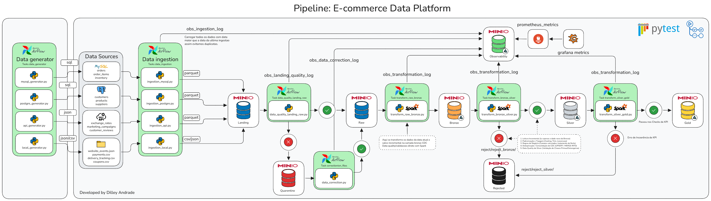

# Data Platform E-commerce

Plataforma de dados end-to-end para e-commerce construída com Python, Apache
Spark, Delta Lake, MinIO/S3, Airflow, FastAPI, PostgreSQL, MySQL, Prometheus e
Grafana. O projeto simula fontes transacionais, executa ingestão incremental,
valida e corrige dados e publica produtos analíticos nas camadas Bronze,
Silver e Gold.

> Projeto para desenvolvimento local e demonstração de engenharia de dados.
> Credenciais, acessos de rede, retenção e capacidade devem ser revistos antes
> de qualquer uso compartilhado ou produtivo.

## Arquitetura



```text
Geradores sintéticos
  |-- PostgreSQL: customers, products, suppliers
  |-- MySQL: orders, order_items, inventory
  |-- API/JSON: reviews, exchange rates, marketing campaigns
  `-- Local: coupons, payments, delivery tracking, website events
                         |
                         v
               Ingestão incremental
                         |
                         v
                      Landing
                         |
                Qualidade e roteamento
                    /           \
                   v             v
                 Raw        Quarantine
                   ^             |
                   +------ Correção
                         |
                         v
               Bronze -> Silver -> Gold
                         |
                         v
        Delta logs + Pushgateway + Prometheus + Grafana
```

## Tecnologias

| Tecnologia | Responsabilidade |
| --- | --- |
| Python 3.11 | Jobs, API, geradores e testes. |
| Spark 3.5.1 | Processamento e extrações JDBC. |
| Delta Lake 3.1.0 | Tabelas ACID e merges. |
| MinIO/S3 | Data lake e logs persistentes. |
| PostgreSQL | Clientes, produtos e fornecedores. |
| MySQL | Pedidos, itens e estoque. |
| FastAPI | Fontes HTTP incrementais. |
| Airflow 2.11.2 | Orquestração. |
| Prometheus/Grafana | Métricas, alertas e dashboards. |
| Pytest | Testes unitários e de contrato. |

## Como o processo funciona

### 1. Geração de dados

Os geradores criam dados relacionados na seguinte ordem lógica:

```text
suppliers / customers / coupons / campaigns / exchange rates
 -> products -> orders -> order_items -> inventory -> payments
 -> delivery_tracking -> customer_reviews -> website_events
```

PostgreSQL e MySQL são inicializados pelos geradores quando banco ou tabelas
não existem e o usuário possui as permissões necessárias. Os datasets da API
são documentos JSON, e as fontes locais são CSV/JSON.

### 2. Ingestão

| Job | Conexão | Saída Landing |
| --- | --- | --- |
| `ingestion_postgres.py` | Spark JDBC | Parquet |
| `ingestion_mysql.py` | Spark JDBC | Parquet |
| `ingestion_api.py` | HTTP GET + Boto3 | JSON |
| `ingestion_local.py` | Filesystem + Boto3 | CSV/JSON |

Layout:

```text
s3://landing/<dataset>/ingestion_date_YYYYMMDD/
```

### 3. Qualidade e correção

O Landing é validado quanto a existência, integridade, volume, schema, campos
obrigatórios e duplicidade de chave.

```text
PASS -> Raw
FAIL -> Quarantine -> Data Correction -> Raw
```

A correção normaliza o schema, elimina colunas inesperadas, adiciona ausentes
e deduplica. Cada check e tentativa é auditável em Delta Lake.

### 4. Bronze, Silver e Gold

- **Bronze:** aplica tipos, normaliza nulos, preserva inválidos e adiciona
  lineage, hash, run e data de ingestão.
- **Silver:** aplica regras de negócio, domínios, integridade referencial,
  completude, outliers e CDC; separa rejected e quarantine.
- **Gold:** constrói fatos, dimensões, agregações, visões 360 e KPIs; valida
  grão, volume e reconciliações antes do overwrite.

### 5. Watermarks

O watermark só é confirmado após o sucesso até Gold. Se uma etapa posterior à
ingestão falhar, a próxima tentativa relê a janela.

## Fontes e conexões

### Visão consolidada

| Sistema | Produção | Consumo | Protocolo |
| --- | --- | --- | --- |
| PostgreSQL | Gerador com Psycopg | Spark JDBC | SQL/JDBC |
| MySQL | Gerador com PyMySQL | Spark JDBC | SQL/JDBC |
| API | Gerador atualiza JSON | Ingestão HTTP | HTTP/JSON |
| Arquivos locais | Gerador CSV/JSON | Ingestão local | Filesystem/S3 |
| MinIO/S3 | Spark e Boto3 | Todos os estágios | S3A/S3 API |
| Pushgateway | Pipeline batch | Prometheus | HTTP |
| API `/metrics` | FastAPI | Prometheus | HTTP |

### PostgreSQL

Tabelas: `public.customers`, `public.products` e `public.suppliers`.

```dotenv
PG_HOST=localhost
PG_PORT=5432
PG_DB=data_platform
PG_USER=<usuario>
PG_PASSWORD=<senha>
```

O gerador usa Psycopg e mantém triggers de `updated_at`. A ingestão usa driver
JDBC PostgreSQL, fetch size 10.000 e particionamento pela chave numérica.

### MySQL

Tabelas: `orders`, `order_items` e `inventory`.

```dotenv
MYSQL_HOST=localhost
MYSQL_PORT=3306
MYSQL_DB=data_platform
MYSQL_USER=<usuario>
MYSQL_PASSWORD=<senha>
```

O gerador protege o conjunto comercial com transação e lock. A ingestão usa
Connector/J, cursor fetch, prepared statements e timezone UTC.

### API Data Platform

```dotenv
API_BASE_URL=http://localhost:8000
```

| Endpoint | Conteúdo |
| --- | --- |
| `/customer-reviews` | Avaliações. |
| `/exchange-rates` | Cotações. |
| `/marketing-campaigns` | Campanhas. |
| `/docs` | Swagger UI. |
| `/metrics` | Métricas Prometheus. |

As rotas de dados aceitam `updated_at_from` e `updated_at_until`.

### Arquivos locais

```text
local_data_source/coupons.csv
local_data_source/payments.csv
local_data_source/delivery_tracking.csv
local_data_source/website_events.json
```

O diretório é configurável por `LOCAL_DATA_PATH`. Todos os registros precisam
de `updated_at` ISO 8601.

### MinIO/S3

```dotenv
AWS_ENDPOINT_URL=http://localhost:9000
AWS_ACCESS_KEY_ID=access_key_minio
AWS_SECRET_ACCESS_KEY=secret_key_minio
```

Boto3 executa operações de objeto; Spark usa S3A com path-style.

## Data lake

| Bucket | Papel | Formato predominante |
| --- | --- | --- |
| `landing` | Recepção transitória por data. | CSV/JSON/Parquet |
| `raw` | Dados aprovados/corrigidos. | Formato de origem |
| `quarantine` | Falhas recuperáveis. | Origem/Delta |
| `bronze` | Dados tipados e rastreáveis. | Delta |
| `silver` | Dados limpos e consolidados. | Delta |
| `rejected` | Erros determinísticos Silver. | Delta |
| `gold` | Produtos analíticos. | Delta |
| `observability` | Logs, falhas e watermarks. | Delta |

## Incrementalidade

Cada um dos 13 datasets possui watermark independente:

```text
lower_bound <= updated_at < upper_bound
```

```dotenv
INCREMENTAL_INITIAL_WATERMARK=1970-01-01T00:00:00Z
INCREMENTAL_OVERLAP_MINUTES=10
```

O overlap relê dados recentes para reduzir perda por atraso da fonte. O estado
fica em `s3a://observability/ingestion_watermarks`.

## Produtos Gold

| Datamart | Tabelas |
| --- | --- |
| `master_data` | `dim_customers`, `dim_suppliers`, `dim_products` |
| `sales` | `fact_sales`, `fact_orders` e cinco agregações |
| `finance` | `fact_payments`, `payments_daily` |
| `supply_chain` | `inventory_snapshot`, `inventory_summary` |
| `logistics` | `fact_deliveries`, `delivery_performance` |
| `customer_experience` | Reviews, satisfação, eventos e engajamento |
| `commercial` | Cupons, campanhas, orçamento e câmbio |
| `executive_analytics` | `customer_360`, `product_360`, `executive_kpis` |

Ao todo são 8 datamarts e 27 tabelas Gold.

## Observabilidade

### Logs Delta

```text
observability/ingestion_log
observability/landing_quality_log
observability/data_correction_log
observability/transformation_log
observability/gold_validation_failures
observability/ingestion_watermarks
```

### Prometheus e Grafana

```dotenv
PROMETHEUS_PUSHGATEWAY_URL=http://localhost:9091
PROMETHEUS_JOB_NAME=data_platform_pipeline
PIPELINE_SLA_SECONDS=3600
```

O pipeline monolítico publica status, duração, SLA, volumes, rejeições e
qualidade no Pushgateway. A API expõe métricas HTTP em `/metrics`.

Arquivos disponíveis:

```text
config/prometheus/prometheus-local.yml
config/prometheus/prometheus-docker-runtime.yml
config/prometheus/prometheus-alerts.yml
config/prometheus/grafana-dashboard.json
```

> A DAG mensal atual grava logs Delta, mas não chama o agregador Prometheus do
> pipeline monolítico. Métricas batch `data_pipeline_*` são publicadas por
> `run_all_pipeline.py`.

## Estrutura do repositório

```text
airflow/dags/             DAGs de geração e pipeline
api_data_platform/        FastAPI e datasets JSON
config/prometheus/        Prometheus, alertas e Grafana
data_generator/           Geradores de fontes
docs/                     Documentação detalhada
local_data_source/        CSV/JSON locais
pipeline/                 Diagrama PNG e Excalidraw
src/                      Código do pipeline
tests/                    Testes separados por processo
```

## Pré-requisitos

- Python 3.11 e Java 17 recomendados;
- PostgreSQL, MySQL e MinIO/S3 acessíveis;
- jars Maven acessíveis na primeira sessão Spark;
- Docker Compose apenas para a orquestração Airflow;
- Pushgateway, Prometheus e Grafana opcionais.

O Compose cria somente o Airflow. Bancos, MinIO, API e observabilidade devem
estar ativos separadamente.

## Instalação

PowerShell:

```powershell
python -m venv .venv
.\.venv\Scripts\Activate.ps1
python -m pip install --upgrade pip
python -m pip install -r requirements.txt
python -m pip install -r tests/requirements-test.txt
$env:PYTHONPATH = "$PWD\src;$PWD"
Copy-Item .env.example .env
```

Bash:

```bash
python3 -m venv .venv
source .venv/bin/activate
python -m pip install -r requirements.txt
python -m pip install -r tests/requirements-test.txt
export PYTHONPATH="$PWD/src:$PWD"
cp .env.example .env
```

Complete `.env` com as conexões reais. Não versione secrets.

Configurações Spark opcionais:

```dotenv
SPARK_MASTER=local[*]
SPARK_SHUFFLE_PARTITIONS=4
SPARK_DEFAULT_PARALLELISM=4
SPARK_DELTA_OPTIMIZE_WRITE=false
SPARK_DELTA_AUTO_COMPACT=false
```

## Preparação da infraestrutura

### Buckets

Crie: `landing`, `raw`, `bronze`, `silver`, `gold`, `observability`,
`rejected` e `quarantine`.

Exemplo com MinIO Client:

```powershell
mc alias set local http://localhost:9000 access_key_minio secret_key_minio
foreach ($bucket in @("landing","raw","bronze","silver","gold","observability","rejected","quarantine")) { mc mb --ignore-existing "local/$bucket" }
```

### API na porta padrão

```powershell
python -m uvicorn api_data_platform.main:app --host 127.0.0.1 --port 8000
```

### API em porta definida

```powershell
python -m uvicorn api_data_platform.main:app --host 127.0.0.1 --port 8081
$env:API_BASE_URL = "http://127.0.0.1:8081"
```

### Portas padrão

| Serviço | URL |
| --- | --- |
| API | `http://127.0.0.1:8000` |
| MinIO API | `http://127.0.0.1:9000` |
| Pushgateway | `http://127.0.0.1:9091` |
| Prometheus | `http://127.0.0.1:9090` |
| Grafana | `http://127.0.0.1:3000` |
| Airflow | `http://127.0.0.1:8080` |

## Execução local

### 1. Gerar fontes

```powershell
python data_generator/run_all_generator.py --average-records 2000 --seed 20260920
```

Dry run:

```powershell
python data_generator/run_all_generator.py --average-records 2000 --seed 20260920 --dry-run
```

### 2. Manter a API ativa

```powershell
python -m uvicorn api_data_platform.main:app --host 127.0.0.1 --port 8000
```

### 3. Executar o pipeline completo

```powershell
python src/run_all_pipeline.py `
  --run-id "manual__2026-09-20" `
  --date "2026-09-20" `
  --watermark-until "2026-09-21T00:00:00Z"
```

### Execução etapa a etapa

```powershell
$runId = "manual__2026-09-20"
$date = "2026-09-20"
$env:PIPELINE_WATERMARK_UNTIL = "2026-09-21T00:00:00Z"

python src/ingestion/ingestion_local.py --run-id $runId --date $date
python src/ingestion/ingestion_postgres.py --run-id $runId --date $date
python src/ingestion/ingestion_mysql.py --run-id $runId --date $date
python src/ingestion/ingestion_api.py --run-id $runId --date $date
python src/data_quality/dq_landing_raw.py --run-id $runId --date $date
python src/data_correction/data_correction.py --run-id "correction_$runId" --date $date
python src/transformation/transformation_raw_bronze.py --run-id $runId --date $date
python src/transformation/transform_bronze_silver.py --run-id $runId --date $date
python src/transformation/transform_silver_gold.py --run-id $runId --date $date
python src/ingestion/commit_incremental_state.py --run-id $runId --date $date
```

Use o mesmo run e data na Bronze e Silver. Confirme watermarks manualmente
somente após sucesso integral.

## Airflow

Serviços do host precisam ser vistos pelo container por
`host.docker.internal`:

```dotenv
AIRFLOW_AWS_ENDPOINT_URL=http://host.docker.internal:9000
AIRFLOW_API_BASE_URL=http://host.docker.internal:8000
AIRFLOW_PG_HOST=host.docker.internal
AIRFLOW_MYSQL_HOST=host.docker.internal
AIRFLOW_PROMETHEUS_PUSHGATEWAY_URL=http://host.docker.internal:9091
GENERATOR_AVERAGE_RECORDS=2000
```

Iniciar:

```powershell
docker compose -f docker-compose.airflow.yml up --build -d
docker compose -f docker-compose.airflow.yml logs -f airflow
```

Interface: `http://localhost:8080`; desenvolvimento local: `admin` /
`airflowadmin`. Troque essas credenciais fora do ambiente local.

### DAGs

| DAG | Agenda | Fluxo |
| --- | --- | --- |
| `synthetic_data_daily_generation` | 01:00 diariamente | Geração coordenada das fontes. |
| `data_platform_monthly_pipeline` | 06:00 no primeiro dia do mês | Ingestão até commit de watermarks. |

Ambas usam `America/Sao_Paulo`, `catchup=False` e `max_active_runs=1`.

Encerrar:

```powershell
docker compose -f docker-compose.airflow.yml down
```

## Testes

```powershell
python -m pytest tests -q
```

Resultado validado:

```text
75 passed
```

A suíte cobre API, geradores, ingestão, qualidade, correção, transformações,
observabilidade, schemas, utilitários e orquestração. Serviços externos são
substituídos por mocks.

## Validação e troubleshooting

Após executar, confira objetos nos buckets, tabelas Delta, logs de qualidade e
transformação, falhas Gold e watermarks.

| Sintoma | Verificação |
| --- | --- |
| `ModuleNotFoundError` | Defina `PYTHONPATH=$PWD/src;$PWD`. |
| MinIO inacessível | Endpoint, buckets, credenciais e permissão `ListBuckets`. |
| JDBC/S3A ausente | Java, internet/cache Ivy e versões Maven. |
| Banco inacessível | Host, porta, firewall, usuário e permissões. |
| API recusou conexão | Uvicorn ativo e `API_BASE_URL` correto. |
| Silver vazia | Mesmo `run_id` e data usados na Bronze. |
| Gold ausente | Fontes Silver obrigatórias e `gold_validation_failures`. |
| Watermark parado | Etapa anterior falhou ou commit não foi executado. |
| Grafana vazio | Targets `UP`, datasource UID `prometheus` e pipeline executado. |

## Segurança e limitações

- não exponha bancos, MinIO, API, Airflow ou observabilidade sem TLS,
  autenticação e controle de rede;
- use secrets externos e privilégio mínimo em ambientes compartilhados;
- a Silver não implementa delete CDC;
- a quarentena Silver não tem promoção automática;
- a Gold faz overwrite e não é transacional entre tabelas do datamart;
- logs Delta não possuem retenção automática;
- datasets ausentes podem gerar skip em algumas etapas;
- o Compose provisiona apenas Airflow.

## Documentação detalhada

| Processo | Documento |
| --- | --- |
| API | [doc_api_data_platform.md](docs/doc_api_data_platform.md) |
| Geradores | [doc_data_generator.md](docs/doc_data_generator.md) |
| Ingestão | [doc_ingestion.md](docs/doc_ingestion.md) |
| Qualidade | [doc_data_quality.md](docs/doc_data_quality.md) |
| Correção | [doc_data_correction.md](docs/doc_data_correction.md) |
| Transformações | [doc_transformations.md](docs/doc_transformations.md) |
| Schemas | [doc_schemas.md](docs/doc_schemas.md) |
| Observabilidade | [doc_observability.md](docs/doc_observability.md) |
| Prometheus/Grafana | [doc_config.md](docs/doc_config.md) |
| Airflow | [doc_airflow_orchestration.md](docs/doc_airflow_orchestration.md) |
| Utilitários | [doc_utils.md](docs/doc_utils.md) |
| Testes | [tests/README.md](tests/README.md) |

## Evolução recomendada

- versionar contratos e alterações incompatíveis;
- adicionar testes para toda nova regra ou dataset;
- implementar delete CDC e reprocessamento da quarentena Silver;
- publicar Gold por staging com troca atômica;
- definir retenção e compactação das tabelas Delta;
- adicionar tarefa Airflow para métricas batch e callback de falha;
- provisionar infraestrutura e secrets como código;
- manter README, documentos e diagrama sincronizados.
