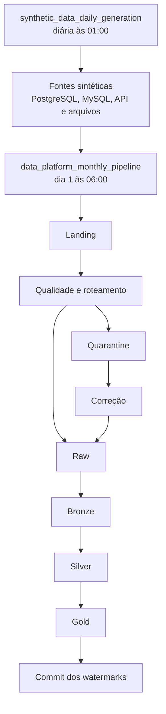

# DAGs e orquestração com Apache Airflow

## 1. Objetivo

O Apache Airflow orquestra dois processos independentes da plataforma:

1. a geração diária de dados sintéticos nas fontes;
2. o pipeline mensal e incremental que ingere, valida, corrige e transforma esses dados até a camada Gold.

As DAGs definem agendamento, dependências, retries, contexto de execução e comandos. A lógica de negócio permanece nos módulos `data_generator` e `src`; o Airflow coordena esses componentes por meio de tarefas `BashOperator`.

## 2. Arquivos relacionados

```text
airflow/
└── dags/
    ├── synthetic_data_daily.py
    └── data_platform_pipeline.py

Dockerfile.airflow
docker-compose.airflow.yml
.env
.env.example
```

| Arquivo | Responsabilidade |
| --- | --- |
| `airflow/dags/synthetic_data_daily.py` | DAG de geração diária das fontes sintéticas. |
| `airflow/dags/data_platform_pipeline.py` | DAG mensal do pipeline Landing → Raw → Bronze → Silver → Gold. |
| `Dockerfile.airflow` | Imagem do Airflow com Python, Java, Spark e dependências do projeto. |
| `docker-compose.airflow.yml` | Execução local do scheduler e webserver em um único container. |
| `.env` | Credenciais e endereços fornecidos ao container. |

## 3. Visão geral da orquestração



As DAGs possuem agendas próprias e não há uma dependência Airflow explícita entre elas. A geração diária abastece continuamente as fontes, enquanto o pipeline mensal consome a janela incremental disponível no momento da execução.

`max_active_runs=1` impede sobreposição de execuções da mesma DAG. Como são DAGs diferentes, uma execução diária e uma mensal ainda podem ocorrer simultaneamente se forem iniciadas no mesmo período.

## 4. Resumo das DAGs

| DAG ID | Arquivo | Agenda | Fuso | Catchup | Retries | Execuções simultâneas |
| --- | --- | --- | --- | --- | --- | --- |
| `synthetic_data_daily_generation` | `synthetic_data_daily.py` | `0 1 * * *` | `America/Sao_Paulo` | Desabilitado | 0 | 1 |
| `data_platform_monthly_pipeline` | `data_platform_pipeline.py` | `0 6 1 * *` | `America/Sao_Paulo` | Desabilitado | 2 por tarefa | 1 |

Interpretação das agendas:

- `0 1 * * *`: todos os dias às 01:00;
- `0 6 1 * *`: no primeiro dia de cada mês às 06:00.

As duas DAGs possuem `start_date` em 1º de janeiro de 2026. Com `catchup=False`, intervalos anteriores não são criados automaticamente quando o scheduler é iniciado ou quando uma DAG é reativada.

## 5. DAG de geração diária

### 5.1 Identificação

- DAG ID: `synthetic_data_daily_generation`;
- tags: `data-platform`, `synthetic-data`, `daily`;
- owner: `data-platform`;
- retries: `0`;
- volume: variável `GENERATOR_AVERAGE_RECORDS`, com padrão `2000` no compose.

### 5.2 Topologia

```mermaid
flowchart LR
    A[generate_postgres_catalog] --> B[generate_coupons]
    B --> C[generate_marketing_campaigns_and_exchange_rates]
    C --> D[generate_mysql_orders_items_and_inventory]
    D --> E[generate_payments_and_delivery_tracking]
    E --> F[generate_customer_reviews]
    F --> G[generate_website_events]
```



Todas as tarefas são sequenciais. Com a trigger rule padrão `all_success`, uma falha interrompe as tarefas posteriores.

### 5.3 Tarefas

| Ordem | Task ID | Script e seleção | Destino principal |
| --- | --- | --- | --- |
| 1 | `generate_postgres_catalog` | `postgres_generator.py` | PostgreSQL: fornecedores, clientes e produtos. |
| 2 | `generate_coupons` | `local_generator.py --datasets coupons` | `local_data_source/coupons.csv`. |
| 3 | `generate_marketing_campaigns_and_exchange_rates` | `api_generator.py --datasets marketing_campaigns exchange_rates` | JSONs da API local. |
| 4 | `generate_mysql_orders_items_and_inventory` | `mysql_generator.py` | MySQL: pedidos, itens e estoque. |
| 5 | `generate_payments_and_delivery_tracking` | `local_generator.py --datasets payments delivery_tracking` | CSVs locais. |
| 6 | `generate_customer_reviews` | `api_generator.py --datasets customer_reviews` | JSON de avaliações da API local. |
| 7 | `generate_website_events` | `local_generator.py --datasets website_events` | JSON de eventos do site. |

A ordem preserva a integridade referencial: produtos dependem de fornecedores; pedidos dependem de clientes, produtos e cupons; pagamentos, entregas, avaliações e eventos dependem das entidades geradas anteriormente.

### 5.4 Seed diária

O Airflow cria `GENERATOR_SEED` a partir do fim do intervalo de dados:

```text
{{ data_interval_end.strftime('%Y%m%d') }}
```

O resultado é uma seed como `20260920`. As tarefas do mesmo intervalo recebem a mesma seed, permitindo reproduzir as escolhas pseudoaleatórias quando o estado das fontes também for o mesmo.

Cada comando recebe:

```text
--average-records "$GENERATOR_AVERAGE_RECORDS" --seed "$GENERATOR_SEED"
```

Para o MySQL, o argumento equivalente é `--average-orders`.

Uma nova tentativa manual com a mesma seed não é necessariamente idempotente: os geradores podem acrescentar registros e os IDs dependem do estado já persistido.

## 6. DAG mensal do pipeline

### 6.1 Identificação

- DAG ID: `data_platform_monthly_pipeline`;
- tags: `data-platform`, `incremental`, `monthly`;
- owner: `data-platform`;
- retries: até duas novas tentativas por tarefa;
- execução máxima simultânea: uma.

### 6.2 Topologia

```mermaid
flowchart LR
    A[ingest_local] --> B[ingest_postgres]
    B --> C[ingest_mysql]
    C --> D[ingest_api]
    D --> E[validate_landing_and_route_raw]
    E --> F[correct_quarantined_data]
    F --> G[transform_raw_to_bronze]
    G --> H[transform_bronze_to_silver]
    H --> I[transform_silver_to_gold]
    I --> J[commit_incremental_watermarks]
```



As quatro fontes são ingeridas sequencialmente. Isso simplifica o controle de falhas e o uso de recursos locais, embora aumente a duração total quando comparado a ingestões paralelas.

### 6.3 Contexto compartilhado

Todas as tarefas recebem três variáveis criadas com templates do Airflow:

| Variável | Template | Uso |
| --- | --- | --- |
| `PIPELINE_RUN_ID` | `airflow__{{ run_id }}` | Identifica logs e dados produzidos pela execução. |
| `PIPELINE_EXECUTION_DATE` | `{{ data_interval_end.strftime('%Y-%m-%d') }}` | Particionamento e data lógica do processamento. |
| `PIPELINE_WATERMARK_UNTIL` | `{{ data_interval_end.isoformat() }}` | Limite superior exclusivo da janela incremental. |

O `BashOperator` executa cada script com:

```text
python <script> --run-id "$PIPELINE_RUN_ID" --date "$PIPELINE_EXECUTION_DATE"
```

`PIPELINE_WATERMARK_UNTIL` não aparece como argumento porque os módulos incrementais o leem diretamente do ambiente. `append_env=True` preserva as demais variáveis configuradas no container.

### 6.4 Etapas do pipeline

#### 1. `ingest_local`

Executa `src/ingestion/ingestion_local.py`.

- descobre arquivos CSV e JSON em `local_data_source`;
- aplica a janela incremental;
- envia os dados para o bucket `landing`;
- registra eventos em `observability/ingestion_log`.

#### 2. `ingest_postgres`

Executa `src/ingestion/ingestion_postgres.py`.

- lê `customers`, `products` e `suppliers` por JDBC;
- utiliza `updated_at` para a seleção incremental;
- grava os dados no bucket `landing`;
- registra sucesso ou falha por tabela.

#### 3. `ingest_mysql`

Executa `src/ingestion/ingestion_mysql.py`.

- lê `inventory`, `order_items` e `orders` por JDBC;
- utiliza `updated_at` para a seleção incremental;
- grava os dados no bucket `landing`;
- registra sucesso ou falha por tabela.

#### 4. `ingest_api`

Executa `src/ingestion/ingestion_api.py`.

- consulta avaliações, cotações e campanhas pela API HTTP;
- envia `updated_at_from` e `updated_at_until` para a API;
- possui três tentativas HTTP para falhas transitórias e status `429`, `500`, `502`, `503` ou `504`;
- usa timeout de conexão de 10 segundos e leitura de 120 segundos;
- grava as respostas no bucket `landing`.

#### 5. `validate_landing_and_route_raw`

Executa `src/data_quality/dq_landing_raw.py`.

- localiza os objetos produzidos em Landing;
- valida existência, formato, conteúdo e regras de qualidade;
- move dados aprovados para `raw`;
- move dados reprovados para `quarantine`;
- registra verificações em `observability/landing_quality_log`.

Falhas técnicas de existência, formato ou roteamento encerram a tarefa com erro. Reprovações de qualidade roteadas corretamente podem seguir para a etapa de correção.

#### 6. `correct_quarantined_data`

Executa `src/data_correction/data_correction.py`.

- lê objetos e registros em `quarantine`;
- tenta aplicar correções suportadas;
- move dados corrigidos para `raw`;
- registra tentativas em `observability/data_correction_log`.

#### 7. `transform_raw_to_bronze`

Executa `src/transformation/transformation_raw_bronze.py`.

- lê dados aprovados em `raw`;
- converte e persiste datasets na camada `bronze`;
- registra volume, status e rejeições da transformação.

#### 8. `transform_bronze_to_silver`

Executa `src/transformation/transform_bronze_silver.py`.

- aplica tipagem, padronização e regras de negócio;
- usa relações entre datasets quando necessário;
- grava dados válidos em `silver`;
- direciona registros inválidos para `rejected` ou `quarantine` conforme a regra.

#### 9. `transform_silver_to_gold`

Executa `src/transformation/transform_silver_gold.py`.

- lê os datasets curados da camada Silver;
- constrói tabelas analíticas e datamarts;
- grava os resultados no bucket `gold`;
- registra falhas de validação em `observability/gold_validation_failures`.

#### 10. `commit_incremental_watermarks`

Executa `src/ingestion/commit_incremental_state.py`.

- confirma o limite `PIPELINE_WATERMARK_UNTIL` para todos os datasets;
- mantém os checkpoints em `s3a://observability/ingestion_watermarks`;
- usa merge Delta por `source_name` e `dataset_name`;
- registra o `run_id` da última execução bem-sucedida.

Essa tarefa só é alcançada quando todas as etapas anteriores terminam com sucesso.

## 7. Watermarks incrementais

O pipeline mantém 13 watermarks:

| Fonte | Datasets |
| --- | --- |
| Local | `coupons`, `delivery_tracking`, `payments`, `website_events` |
| PostgreSQL | `customers`, `products`, `suppliers` |
| MySQL | `inventory`, `order_items`, `orders` |
| API | `customer_review`, `exchange_rates`, `marketing_campaigns` |

A janela é calculada como:

```text
lower_bound = max(INCREMENTAL_INITIAL_WATERMARK, watermark_confirmado - overlap)
upper_bound = PIPELINE_WATERMARK_UNTIL
```

Configurações padrão:

- `INCREMENTAL_INITIAL_WATERMARK=1970-01-01T00:00:00Z`;
- `INCREMENTAL_OVERLAP_MINUTES=10`.

O limite inferior é inclusivo e o superior é exclusivo. O overlap relê alguns minutos já processados para reduzir o risco de perder atualizações atrasadas. As camadas posteriores precisam tratar essa releitura de forma consistente.

### Estratégia de confirmação tardia

Os watermarks não são atualizados ao final de cada ingestão. Eles são confirmados somente depois de Gold:

```text
ingestões → qualidade → correção → Bronze → Silver → Gold → commit
```

Se qualquer tarefa falhar antes do commit, o checkpoint anterior permanece. A próxima execução volta a ler a janela ainda não confirmada, incluindo o overlap configurado.

## 8. Propagação de falhas e retries

Cada script cria uma sessão Spark própria e a encerra ao final da tarefa. Eventos retornados pelas funções são avaliados por `raise_for_failed_events`; se houver status `FAILED`, o processo termina com erro e o `BashOperator` marca a tarefa como failed.

Com a trigger rule padrão:

- tarefas downstream não executam após uma falha;
- a DAG diária não tenta novamente automaticamente;
- cada tarefa da DAG mensal pode realizar até dois retries;
- os watermarks não são confirmados enquanto a cadeia completa não tiver sucesso.

Nem todas as etapas são transacionalmente atômicas entre si. Antes de limpar uma tarefa para reexecução, verifique os dados já gravados em S3/MinIO e os logs da camada `observability`.

## 9. Observabilidade

Os jobs persistem tabelas Delta no bucket `observability`:

- `ingestion_log`;
- `landing_quality_log`;
- `data_correction_log`;
- `transformation_log`;
- `gold_validation_failures`;
- `ingestion_watermarks`.

Além dessas tabelas, o Airflow registra stdout, stderr, duração, tentativa e status de cada tarefa em sua interface.

O arquivo `src/run_all_pipeline.py` oferece uma execução monolítica alternativa e envia métricas agregadas ao Prometheus Pushgateway. A DAG mensal atual não chama esse arquivo: ela executa cada estágio separadamente para obter visibilidade e retries por tarefa. Portanto, o envio agregado feito por `push_pipeline_metrics` não ocorre diretamente nessa DAG.

## 10. Infraestrutura do Airflow

### Imagem

O `Dockerfile.airflow` usa:

- Apache Airflow `2.11.2`;
- Python `3.11`;
- Java `17` para o Spark;
- dependências definidas em `requirements.txt`.

O build executa `pip check` para detectar incompatibilidades entre pacotes.

### Container

O compose executa scheduler e webserver no mesmo container:

```text
airflow scheduler &
exec airflow webserver
```

Configurações principais:

- interface web publicada em `http://localhost:8080`;
- timezone padrão `America/Sao_Paulo`;
- exemplos oficiais desabilitados;
- migração do banco de metadados no startup;
- criação automática do usuário administrador local;
- Spark em `local[*]`;
- restart `unless-stopped`.

### Volumes

| Origem | Destino | Uso |
| --- | --- | --- |
| `airflow2_fixed_home` | `/opt/airflow` | Metadados, logs e estado persistente do Airflow. |
| `./airflow/dags` | `/opt/airflow/dags` | DAGs montadas como somente leitura. |
| raiz do projeto | `/opt/airflow/data-platform` | Código, arquivos e dados acessados pelos jobs. |

O diretório do projeto é o `cwd` padrão das tarefas. O `PYTHONPATH` inclui `src` e a raiz do repositório.

## 11. Dependências externas

O `docker-compose.airflow.yml` inicia somente o Airflow. Ele não inicia:

- MinIO ou outro armazenamento S3;
- PostgreSQL;
- MySQL;
- API Data Platform;
- Prometheus Pushgateway.

Esses serviços precisam estar acessíveis antes das tarefas que dependem deles. No Windows, o container usa `host.docker.internal` para acessar processos executados no host.

## 12. Variáveis de ambiente

As credenciais completas são carregadas de `.env`. O compose sobrescreve os endereços vistos de dentro do container:

| Variável no container | Origem ou padrão | Finalidade |
| --- | --- | --- |
| `AWS_ENDPOINT_URL` | `AIRFLOW_AWS_ENDPOINT_URL` | Endpoint do MinIO/S3. |
| `API_BASE_URL` | `AIRFLOW_API_BASE_URL` | Endereço da API Data Platform. |
| `PG_HOST` | `AIRFLOW_PG_HOST` | Host do PostgreSQL. |
| `MYSQL_HOST` | `AIRFLOW_MYSQL_HOST` | Host do MySQL. |
| `PROMETHEUS_PUSHGATEWAY_URL` | `AIRFLOW_PROMETHEUS_PUSHGATEWAY_URL` | Endpoint do Pushgateway. |
| `GENERATOR_AVERAGE_RECORDS` | padrão `2000` | Volume médio da geração diária. |
| `SPARK_MASTER` | `local[*]` | Execução Spark local ao container. |

Exemplo para serviços executados no host:

```dotenv
AIRFLOW_AWS_ENDPOINT_URL=http://host.docker.internal:9000
AIRFLOW_API_BASE_URL=http://host.docker.internal:8000
AIRFLOW_PG_HOST=host.docker.internal
AIRFLOW_MYSQL_HOST=host.docker.internal
AIRFLOW_PROMETHEUS_PUSHGATEWAY_URL=http://host.docker.internal:9091
GENERATOR_AVERAGE_RECORDS=2000
```

Portas, usuários, senhas e bancos continuam sendo obtidos das demais variáveis `AWS_*`, `PG_*` e `MYSQL_*` do `.env`.

## 13. Construir e iniciar o Airflow localmente

Os comandos abaixo são apenas instruções operacionais; executá-los inicia o Airflow com Docker.

Na raiz do projeto:

```powershell
docker compose -f docker-compose.airflow.yml up --build --detach
```

Verificar o container:

```powershell
docker compose -f docker-compose.airflow.yml ps
```

Acompanhar os logs:

```powershell
docker compose -f docker-compose.airflow.yml logs --follow airflow
```

A interface estará em:

```text
http://localhost:8080
```

Credenciais locais configuradas no compose:

```text
usuário: admin
senha: airflowadmin
```

Essas credenciais são apropriadas apenas para desenvolvimento local e devem ser substituídas em qualquer ambiente compartilhado.

## 14. Operação das DAGs

### Listar DAGs

```powershell
docker compose -f docker-compose.airflow.yml exec airflow airflow dags list
```

### Verificar erros de importação

```powershell
docker compose -f docker-compose.airflow.yml exec airflow airflow dags list-import-errors
```

### Despausar

```powershell
docker compose -f docker-compose.airflow.yml exec airflow airflow dags unpause synthetic_data_daily_generation
docker compose -f docker-compose.airflow.yml exec airflow airflow dags unpause data_platform_monthly_pipeline
```

### Executar manualmente

```powershell
docker compose -f docker-compose.airflow.yml exec airflow airflow dags trigger synthetic_data_daily_generation
docker compose -f docker-compose.airflow.yml exec airflow airflow dags trigger data_platform_monthly_pipeline
```

Também é possível usar o botão **Trigger DAG** na interface web.

### Interromper o Airflow

```powershell
docker compose -f docker-compose.airflow.yml down
```

O volume nomeado é preservado por esse comando. Não use `down --volumes` se precisar manter metadados e logs.

## 15. Validação antes de uma execução

Antes de liberar as DAGs, confirme:

1. o container aparece como ativo no compose;
2. as duas DAGs aparecem em `airflow dags list`;
3. não há erros em `airflow dags list-import-errors`;
4. MinIO/S3 está acessível e os buckets necessários existem;
5. PostgreSQL e MySQL aceitam conexões com as credenciais configuradas;
6. a API responde a partir do container no valor de `API_BASE_URL`;
7. Java e Spark inicializam no container;
8. o diretório do projeto está montado e gravável;
9. os valores de watermark e overlap estão corretos;
10. há espaço em disco para dados, metadados e logs.

Um teste de conectividade da API a partir do container pode ser feito com Python:

```powershell
docker compose -f docker-compose.airflow.yml exec airflow python -c "import requests; print(requests.get('http://host.docker.internal:8000/docs', timeout=10).status_code)"
```

## 16. Reexecução e recuperação

### Falha na geração diária

Como não há retries automáticos, investigue a tarefa e execute-a novamente pela interface. Considere que tarefas anteriores da mesma execução podem ter persistido dados.

### Falha no pipeline mensal

O Airflow tenta novamente a tarefa com falha até o limite configurado. Se as tentativas forem esgotadas:

1. consulte o log da tarefa;
2. verifique as tabelas do bucket `observability`;
3. corrija a dependência externa ou o dado inválido;
4. limpe somente a tarefa necessária e suas downstreams;
5. confirme que o watermark final ainda não foi avançado.

O commit tardio reduz o risco de pular dados após uma falha, mas uma reexecução pode reler e regravar partes já produzidas. A análise deve considerar o `run_id`, a partição de execução e a semântica de escrita de cada camada.

## 17. Limitações e cuidados

- Scheduler e webserver compartilham um único container; essa topologia é destinada ao ambiente local.
- O executor e o banco de metadados seguem os padrões da imagem, pois não estão explicitamente configurados no compose.
- As tarefas Spark usam os recursos do mesmo container.
- As ingestões são sequenciais, não paralelas.
- Não existe dependência formal entre a DAG diária e a mensal.
- `max_active_runs=1` não impede concorrência entre as duas DAGs.
- A DAG diária não é globalmente transacional entre bancos e arquivos.
- A DAG mensal confirma watermarks somente no final, mas etapas intermediárias podem ter escrito dados antes de uma falha.
- Senha administrativa e configuração local não devem ser reutilizadas em produção.

## 18. Solução de problemas

### DAG não aparece

Execute `airflow dags list-import-errors`, confira o mount `./airflow/dags:/opt/airflow/dags:ro` e valide as dependências Python da imagem.

### API inacessível no container

Não use `localhost` para um serviço executado no host. Configure `AIRFLOW_API_BASE_URL` com `host.docker.internal` e a porta correta.

### MinIO ou S3 inacessível

Confira `AIRFLOW_AWS_ENDPOINT_URL`, credenciais `AWS_*`, buckets e a resolução de `host.docker.internal`.

### Falha JDBC

Valide host, porta, banco, usuário e senha. Dentro do container, `PG_HOST` e `MYSQL_HOST` normalmente precisam apontar para `host.docker.internal`.

### Spark não inicia

Confirme que a imagem foi reconstruída após mudanças no Dockerfile e que Java 17 está disponível por meio de `JAVA_HOME`.

### Watermark não avançou

O comportamento é esperado quando uma etapa anterior falha. O commit ocorre somente depois de Gold e exige `PIPELINE_WATERMARK_UNTIL`.

### A execução manual processou uma data inesperada

Os templates usam `data_interval_end`. Consulte o intervalo lógico atribuído pelo Airflow ao DAG run manual e compare-o com `PIPELINE_EXECUTION_DATE` e `PIPELINE_WATERMARK_UNTIL` no log renderizado da tarefa.
