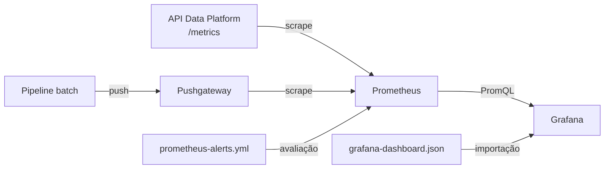

# Configurações de observabilidade

## 1. Objetivo

A pasta `config` reúne as configurações de observabilidade da plataforma. No estado atual, todo o conteúdo está concentrado em `config/prometheus` e integra quatro componentes:

- a API Data Platform, que expõe métricas HTTP;
- o Prometheus Pushgateway, que recebe métricas do pipeline batch;
- o Prometheus, que coleta e avalia as métricas;
- o Grafana, que apresenta o dashboard operacional.

Essa pasta contém somente arquivos de configuração. Ela não instala nem inicia Prometheus, Pushgateway ou Grafana.

## 2. Estrutura da pasta

```text
config/
└── prometheus/
    ├── prometheus-local.yml
    ├── prometheus-docker-runtime.yml
    ├── prometheus-alerts.yml
    └── grafana-dashboard.json
```

| Arquivo | Responsabilidade |
| --- | --- |
| `prometheus-local.yml` | Coleta quando Prometheus, API e Pushgateway executam diretamente na máquina local. |
| `prometheus-docker-runtime.yml` | Coleta quando o Prometheus executa em container e acessa serviços no host ou na rede Docker. |
| `prometheus-alerts.yml` | Regras de alerta do pipeline e da qualidade de dados. |
| `grafana-dashboard.json` | Dashboard importável do Grafana com métricas do pipeline e da API. |

## 3. Arquitetura



Existem dois modelos de exposição:

1. **Pull:** o Prometheus consulta periodicamente `/metrics` da API.
2. **Push seguido de pull:** o pipeline envia métricas ao Pushgateway, e o Prometheus coleta o Pushgateway.

O pipeline é um processo batch e pode terminar antes que o Prometheus consiga coletá-lo diretamente. O Pushgateway mantém a última série publicada disponível para coleta.

## 4. Configuração local do Prometheus

Arquivo: `config/prometheus/prometheus-local.yml`.

Use este arquivo quando todos os serviços executarem diretamente na mesma máquina.

### Configurações globais

```yaml
global:
  scrape_interval: 15s
  evaluation_interval: 15s
```

- `scrape_interval`: o Prometheus coleta cada target a cada 15 segundos;
- `evaluation_interval`: as regras de gravação e alerta são avaliadas a cada 15 segundos.

### Regras

```yaml
rule_files:
  - "prometheus-alerts.yml"
```

O arquivo de alertas fica no mesmo diretório. Para evitar problemas com o caminho relativo, execute o Prometheus com `config/prometheus` como diretório atual ou ajuste `rule_files` para um caminho absoluto compatível com o ambiente.

### Targets locais

| Job | Target | Função |
| --- | --- | --- |
| `prometheus` | `127.0.0.1:9090` | Automonitoramento do Prometheus. |
| `data-platform-api` | `127.0.0.1:8000/metrics` | Métricas HTTP da API. |
| `pushgateway` | `127.0.0.1:9091` | Métricas batch publicadas pelo pipeline. |

O caminho `/metrics` está explícito no job da API. Nos demais jobs, o Prometheus usa o caminho padrão `/metrics`.

## 5. Configuração do Prometheus em container

Arquivo: `config/prometheus/prometheus-docker-runtime.yml`.

Use este arquivo quando o Prometheus executar dentro de Docker e a API executar no host, enquanto o Pushgateway estiver na rede Docker.

| Job | Target | Perspectiva de rede |
| --- | --- | --- |
| `prometheus` | `127.0.0.1:9090` | O próprio container do Prometheus. |
| `data-platform-api` | `host.docker.internal:8000` | API executada no host. |
| `pushgateway` | `data-platform-pushgateway:9091` | Container ou alias DNS do Pushgateway. |

Para `data-platform-pushgateway` resolver corretamente, Prometheus e Pushgateway precisam compartilhar uma rede Docker, e o Pushgateway precisa possuir esse nome ou alias.

`host.docker.internal` funciona nativamente no Docker Desktop. Em ambientes Linux sem esse nome configurado, pode ser necessário mapear o host gateway ou substituir o target por um endereço acessível ao container.

## 6. Diferenças entre os dois runtimes

| Componente | Configuração local | Configuração Docker |
| --- | --- | --- |
| Prometheus | `127.0.0.1:9090` | `127.0.0.1:9090` dentro do container. |
| API | `127.0.0.1:8000` | `host.docker.internal:8000`. |
| Pushgateway | `127.0.0.1:9091` | `data-platform-pushgateway:9091`. |
| Alertas | Mesmo arquivo | Mesmo arquivo |
| Intervalo de coleta | 15 segundos | 15 segundos |

Não misture os arquivos sem revisar os targets. Para o Prometheus em container, `127.0.0.1` aponta para o próprio container e não para a máquina host.

## 7. Métricas da API

A API usa `prometheus-fastapi-instrumentator` em `api_data_platform/main.py`. O endpoint de coleta é:

```text
http://127.0.0.1:8000/metrics
```

As consultas do dashboard utilizam principalmente:

| Métrica | Uso |
| --- | --- |
| `http_requests_total` | Contagem e taxa de requisições por rota e status. |
| `http_request_duration_seconds_sum` | Soma da duração das requisições. |
| `http_request_duration_seconds_count` | Quantidade de observações de duração. |

O dashboard exclui o próprio handler `/metrics` de algumas consultas para que a coleta do Prometheus não distorça a taxa e a duração das rotas de negócio.

O job precisa permanecer com o nome `data-platform-api`, pois as consultas do dashboard filtram por:

```promql
{job="data-platform-api"}
```

Se o nome do job for alterado, as consultas correspondentes no dashboard também devem ser atualizadas.

## 8. Métricas do pipeline

As métricas batch são criadas em `src/observability/prometheus_metrics.py` e enviadas ao Pushgateway por `pushadd_to_gateway`.

Configurações de ambiente:

```dotenv
PROMETHEUS_PUSHGATEWAY_URL=http://localhost:9091
PROMETHEUS_JOB_NAME=data_platform_pipeline
PIPELINE_SLA_SECONDS=3600
```

### Métricas gerais

| Métrica | Tipo | Significado |
| --- | --- | --- |
| `data_pipeline_last_status` | Gauge | `1` para sucesso e `0` para falha da última execução. |
| `data_pipeline_last_duration_seconds` | Gauge | Duração total da última execução. |
| `data_pipeline_duration_sla_seconds` | Gauge | SLA máximo configurado em segundos. |
| `data_pipeline_duration_sla_violation` | Gauge | `1` quando a duração excedeu o SLA. |
| `data_pipeline_last_completion_timestamp_seconds` | Gauge | Timestamp Unix da última conclusão. |
| `data_pipeline_last_success_timestamp_seconds` | Gauge | Timestamp Unix do último sucesso. |
| `data_pipeline_last_failure_timestamp_seconds` | Gauge | Timestamp Unix da última falha. |

O SLA padrão é de 3.600 segundos. Um valor ausente, inválido ou menor ou igual a zero faz o código usar esse padrão.

### Métricas por estágio

As métricas abaixo possuem o label `stage`:

| Métrica | Significado |
| --- | --- |
| `data_pipeline_stage_duration_seconds` | Soma das durações dos eventos no estágio. |
| `data_pipeline_records_input` | Registros lidos. |
| `data_pipeline_records_output` | Registros produzidos. |
| `data_pipeline_records_rejected` | Registros rejeitados. |
| `data_pipeline_stage_failures` | Eventos com status de falha. |

Os estágios esperados pelo executor monolítico são `ingestion`, `correction`, `bronze`, `silver` e `gold`.

### Métricas de qualidade

| Métrica | Significado |
| --- | --- |
| `data_pipeline_quality_checks_failed{check_type=...}` | Quantidade de verificações reprovadas por tipo. |
| `data_pipeline_quality_ratio` | Proporção de registros aceitos na entrada da Silver. |
| `data_pipeline_quality_records_invalid` | Registros rejeitados observados na Silver. |

### Label `job`

Alertas e dashboard filtram por:

```promql
{job="data_platform_pipeline"}
```

Esse valor precisa coincidir com `PROMETHEUS_JOB_NAME`. Se o nome for personalizado, ajuste também `prometheus-alerts.yml` e `grafana-dashboard.json`.

## 9. Pushgateway e `honor_labels`

O job do Pushgateway possui:

```yaml
honor_labels: true
```

O Pushgateway expõe séries que já possuem um label `job` definido no momento do push. Com `honor_labels: true`, o Prometheus preserva esse valor, permitindo que as consultas encontrem `job="data_platform_pipeline"`.

Sem essa opção, o Prometheus pode substituir o label pelo nome do scrape job (`pushgateway`) e mover o valor original para um label como `exported_job`, quebrando os filtros atuais.

O uso de `pushadd_to_gateway` atualiza as métricas publicadas sem apagar necessariamente outras séries anteriores do mesmo grupo. Por isso, timestamps de último sucesso e última falha podem continuar disponíveis entre execuções.

## 10. Regras de alerta

Arquivo: `config/prometheus/prometheus-alerts.yml`.

As regras pertencem ao grupo `data-platform-pipeline` e são avaliadas a cada 15 segundos.

### `DataPipelineLastRunFailed`

```promql
data_pipeline_last_status{job="data_platform_pipeline"} == 0
```

- condição: a última execução publicada falhou;
- duração mínima: 1 minuto;
- severidade: `critical`.

Uma falha transitória que desapareça antes de um minuto não chega ao estado firing.

### `DataPipelineFreshnessExceeded`

```promql
time() - data_pipeline_last_completion_timestamp_seconds{job="data_platform_pipeline"} > 90000
```

- condição: não existe conclusão nova há mais de 90.000 segundos, equivalentes a 25 horas;
- duração mínima: 5 minutos;
- severidade: `critical`.

Essa regra foi desenhada para uma frequência aproximadamente diária. A DAG de pipeline documentada atualmente é mensal; portanto, a regra ficará ativa durante a maior parte do mês depois que houver uma métrica de conclusão. Para uma rotina mensal, ajuste o limite para a expectativa mensal acrescida da tolerância operacional ou altere a frequência do pipeline monitorado.

### `DataPipelineDurationSlaViolated`

```promql
data_pipeline_duration_sla_violation{job="data_platform_pipeline"} == 1
```

- condição: a duração total ultrapassou `PIPELINE_SLA_SECONDS`;
- duração mínima: 1 minuto;
- severidade: `warning`.

### `DataPipelineQualityBelowTarget`

```promql
data_pipeline_quality_ratio{job="data_platform_pipeline"} < 0.98
```

- condição: menos de 98% dos registros de entrada da Silver foram aceitos;
- duração mínima: 5 minutos;
- severidade: `warning`.

### `DataPipelineRejectedRateHigh`

```promql
sum(data_pipeline_records_rejected{job="data_platform_pipeline"})
/
clamp_min(sum(data_pipeline_records_input{job="data_platform_pipeline"}), 1)
> 0.05
```

- condição: taxa agregada de rejeição acima de 5%;
- duração mínima: 5 minutos;
- severidade: `warning`;
- `clamp_min(..., 1)` evita divisão por zero.

## 11. Ausência de séries

As regras atuais não implementam alertas específicos para métricas ausentes. Quando nenhuma série compatível existe, uma expressão normalmente retorna um vetor vazio e o alerta não dispara.

Isso significa que:

- Pushgateway indisponível antes do primeiro push pode não gerar esses alertas;
- mudança incorreta do label `job` pode fazer alertas e painéis ficarem vazios;
- a regra de freshness só pode avaliar o atraso depois que existe um timestamp de conclusão.

Use também a página `/targets`, a métrica `up` e, se necessário, regras baseadas em `absent()` para monitorar a própria coleta.

## 12. Notificações de alerta

O Prometheus avalia as regras e expõe alertas nos estados pending e firing. Entretanto, não existe configuração de Alertmanager nesta pasta.

Consequências:

- alertas aparecem no Prometheus;
- o painel “Active Pipeline Alerts” do Grafana consegue contá-los;
- nenhuma notificação por e-mail, Slack, Teams ou outro canal é enviada por esta configuração.

Para entrega de notificações, é necessário executar um Alertmanager e adicionar a seção `alerting` ao arquivo do Prometheus.

## 13. Dashboard do Grafana

Arquivo: `config/prometheus/grafana-dashboard.json`.

Metadados principais:

| Propriedade | Valor |
| --- | --- |
| Título | `Data Platform - Pipeline Overview` |
| UID | `data-platform-overview` |
| Schema version | `41` |
| Timezone | Fuso do navegador |
| Janela inicial | Últimas 24 horas |
| Atualização automática | 15 segundos |
| Tags | `data-platform`, `prometheus` |
| Quantidade de painéis | 26 |

O dashboard é editável e usa tooltip compartilhada entre gráficos.

### Datasource obrigatório

Todos os painéis referenciam:

```json
{"type": "prometheus", "uid": "prometheus"}
```

Antes da importação, crie ou ajuste um datasource Prometheus com UID exatamente igual a `prometheus`. Um datasource com apenas o nome “Prometheus”, mas UID diferente, não satisfaz essa referência.

### Painéis de estado e volume

| Painel | Informação |
| --- | --- |
| Last Run Status | Sucesso ou falha da última execução. |
| Pipeline Runs | Mudanças no timestamp de conclusão dentro da janela. |
| Failed Runs | Mudanças no timestamp de falha. |
| Pipeline Success Rate | Percentual de sucessos estimado na janela. |
| Average Pipeline Duration | Média da duração na janela selecionada. |
| Data Quality Rate | Percentual aceito na Silver. |
| Gold Records Produced | Registros produzidos no estágio Gold. |
| Time Since Last Run | Segundos desde a última conclusão. |
| Invalid or Rejected Records | Registros inválidos da última Silver. |
| Failures by Stage | Soma das falhas por estágio. |

### Painéis de evolução e diagnóstico

| Painel | Informação |
| --- | --- |
| Pipeline Duration Over Time | Duração total ao longo do tempo. |
| Duration by Stage | Comparação da duração entre estágios. |
| Records by Stage | Entrada, saída e rejeições por estágio. |
| Failed Data Quality Checks | Falhas agrupadas por tipo de verificação. |
| Last Successful Run | Data e hora do último sucesso. |
| Last Failed Run | Data e hora da última falha. |
| Execution Status Over Time | Linha do tempo de sucesso e falha. |
| Rejected Records Rate | Percentual agregado de rejeições. |
| Input vs Output by Stage | Comparação de entrada e saída. |
| Stage Bottleneck | Estágio com maior duração. |
| Pipeline SLA Status | Estado da violação do SLA. |

### Painéis da API e alertas

| Painel | Informação |
| --- | --- |
| API Request Rate | Requisições por segundo e endpoint. |
| API Error Rate | Respostas 4xx e 5xx por endpoint. |
| API Average Request Duration | Latência média calculada com sum/count. |
| API Requests by Endpoint | Total de requisições na janela selecionada. |
| Active Pipeline Alerts | Quantidade de alertas `DataPipeline*` em firing. |

### Thresholds relevantes

- sucesso do pipeline: verde a partir de 99%, amarelo a partir de 95%;
- qualidade: verde a partir de 98%, amarelo a partir de 95%;
- rejeição: amarelo a partir de 2%, vermelho a partir de 5%;
- qualquer falha, registro inválido, violação de SLA ou alerta ativo muda o indicador para vermelho.

## 14. Limitação da instrumentação atual

As métricas agregadas do pipeline são enviadas por `src/run_all_pipeline.py`, que chama `push_pipeline_metrics` ao finalizar.

A DAG mensal atual executa cada estágio em um processo separado e não chama `run_all_pipeline.py`. Portanto, essa DAG não publica automaticamente o conjunto agregado esperado pelos alertas e pelos painéis `data_pipeline_*`.

Para alinhar a observabilidade com a DAG, é necessário escolher uma estratégia, por exemplo:

1. adicionar uma tarefa final que agregue os logs da execução e publique as métricas;
2. instrumentar cada tarefa para publicar seu estágio;
3. executar o entrypoint monolítico quando métricas agregadas forem obrigatórias.

Sem essa integração, os painéis do pipeline podem permanecer vazios ou mostrar a última execução publicada por outro método.

## 15. Executar localmente

Uma sequência típica, sem Docker, é:

1. iniciar a API na porta 8000;
2. iniciar o Pushgateway na porta 9091;
3. iniciar o Prometheus com `prometheus-local.yml`;
4. configurar o datasource no Grafana;
5. importar o dashboard.

### Pushgateway

Exemplo de execução nativa:

```powershell
.\pushgateway.exe --web.listen-address=:9091
```

### Prometheus

Execute a partir da pasta que contém a configuração e as regras:

```powershell
Set-Location config\prometheus
.\prometheus.exe --config.file=prometheus-local.yml
```

Se o executável estiver em outra pasta, use seu caminho completo.

Endereços esperados:

| Serviço | Endereço |
| --- | --- |
| Prometheus | `http://127.0.0.1:9090` |
| Targets | `http://127.0.0.1:9090/targets` |
| Regras | `http://127.0.0.1:9090/rules` |
| Alertas | `http://127.0.0.1:9090/alerts` |
| Pushgateway | `http://127.0.0.1:9091` |
| API metrics | `http://127.0.0.1:8000/metrics` |

## 16. Usar a configuração Docker

Ao construir uma composição própria para observabilidade:

- monte `prometheus-docker-runtime.yml` como arquivo principal do Prometheus;
- monte `prometheus-alerts.yml` no caminho esperado por `rule_files`;
- conecte Prometheus e Pushgateway à mesma rede;
- atribua ao Pushgateway o nome ou alias `data-platform-pushgateway`;
- permita acesso a `host.docker.internal:8000` para coletar a API.

Esta configuração não possui um `docker-compose` próprio dentro da pasta `config`. O arquivo `docker-compose.airflow.yml` também não cria Prometheus, Pushgateway ou Grafana.

## 17. Validar as configurações

Com `promtool` disponível, execute dentro de `config/prometheus`:

```powershell
promtool check config prometheus-local.yml
promtool check config prometheus-docker-runtime.yml
promtool check rules prometheus-alerts.yml
```

Resultados bem-sucedidos confirmam sintaxe e estrutura, mas não garantem conectividade com os targets.

Para consultar o estado dos targets:

```powershell
Invoke-RestMethod http://127.0.0.1:9090/api/v1/targets
```

Para consultar a métrica `up`:

```powershell
Invoke-RestMethod "http://127.0.0.1:9090/api/v1/query?query=up"
```

Interpretação:

- `up == 1`: o target respondeu à última coleta;
- `up == 0`: a coleta falhou;
- série ausente: target não configurado, ainda não descoberto ou consulta incorreta.

## 18. Importar o dashboard

Na interface do Grafana:

1. crie o datasource Prometheus;
2. defina seu UID como `prometheus`;
3. aponte a URL para o Prometheus visto pelo servidor Grafana;
4. abra **Dashboards → New → Import**;
5. envie `config/prometheus/grafana-dashboard.json`;
6. confirme o datasource e finalize a importação.

A URL do datasource depende de onde o Grafana executa:

- Grafana nativo: normalmente `http://127.0.0.1:9090`;
- Grafana em container: use o nome DNS do container Prometheus na mesma rede, não `127.0.0.1`.

Não há provisionamento automático de datasource ou dashboard nesta pasta.

## 19. Alterar portas e endereços

### API em outra porta

Atualize o target `data-platform-api` no arquivo de runtime escolhido:

```yaml
- targets:
    - "127.0.0.1:8081"
```

Em Docker, mantenha a perspectiva do container:

```yaml
- targets:
    - "host.docker.internal:8081"
```

### Pushgateway em outra porta

Atualize simultaneamente:

- o target do job `pushgateway` no Prometheus;
- `PROMETHEUS_PUSHGATEWAY_URL` no processo local;
- `AIRFLOW_PROMETHEUS_PUSHGATEWAY_URL` quando o pipeline executar pelo Airflow.

### Nome do job do pipeline

Ao alterar `PROMETHEUS_JOB_NAME`, substitua o filtro `job="data_platform_pipeline"` em todas as regras e consultas do dashboard.

## 20. Recarregar alterações

Depois de editar YAMLs, valide-os com `promtool` e reinicie o Prometheus.

Se o Prometheus tiver sido iniciado com `--web.enable-lifecycle`, também é possível solicitar reload:

```powershell
Invoke-WebRequest -Method Post http://127.0.0.1:9090/-/reload
```

Sem essa flag, o endpoint de reload não fica habilitado. A importação do dashboard deve ser repetida ou atualizada no Grafana quando o JSON mudar.

## 21. Segurança

As configurações não habilitam autenticação ou TLS para Prometheus, Pushgateway ou API. Recomendações:

- mantenha os serviços vinculados a interfaces locais em desenvolvimento;
- não publique as portas `8000`, `9090`, `9091` ou `3000` diretamente na internet;
- proteja o Grafana com credenciais próprias;
- controle quem pode publicar no Pushgateway;
- use proxy reverso, TLS e autenticação em ambientes compartilhados;
- nunca armazene senhas ou tokens nos arquivos versionados desta pasta.

## 22. Solução de problemas

### Target da API está down

Confirme que a API está ativa, que `/metrics` responde e que o endereço foi definido da perspectiva do processo Prometheus.

### Target do Pushgateway está down

Verifique a porta, o processo e, em Docker, o nome DNS e a rede compartilhada.

### Métricas do pipeline não aparecem

Confirme:

1. `PROMETHEUS_PUSHGATEWAY_URL` está configurada;
2. algum processo chamou `push_pipeline_metrics`;
3. o Pushgateway recebeu o grupo correto;
4. `honor_labels` está habilitado;
5. o label `job` é `data_platform_pipeline`;
6. o Prometheus está coletando o Pushgateway.

### Métricas da API aparecem, mas os painéis estão vazios

Confira se o job do Prometheus se chama exatamente `data-platform-api` e se os nomes dos labels produzidos pela versão instalada do instrumentador coincidem com as consultas do dashboard.

### Dashboard mostra “No data”

Verifique o UID do datasource, a janela de tempo, os labels `job`, a disponibilidade das séries e a conectividade do Grafana com o Prometheus.

### Alertas aparecem no Prometheus, mas nenhuma mensagem é enviada

Esse é o comportamento esperado sem Alertmanager. Configure um Alertmanager e rotas de notificação para entregar alertas externamente.

### Alerta de freshness permanece ativo

Compare o limite de 25 horas com a frequência real do pipeline. Para a DAG mensal atual, o threshold precisa ser revisto.

### Arquivo de regras não encontrado

Execute o Prometheus a partir de `config/prometheus`, monte os dois arquivos no mesmo diretório ou use um caminho de regras compatível com o runtime.
