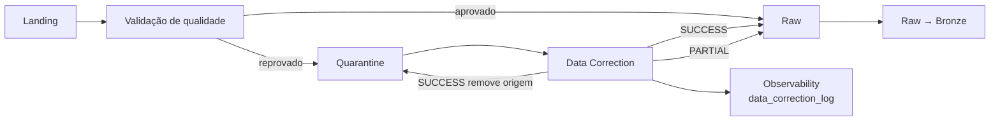
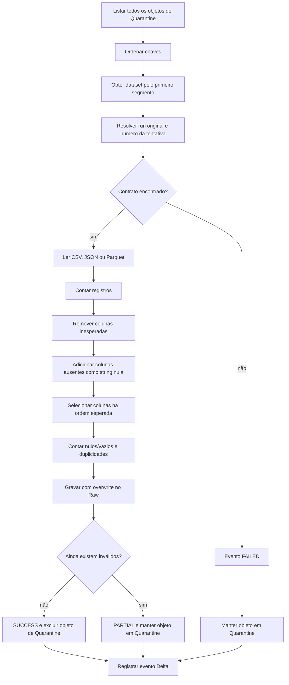

# Processo de correção de dados

## 1. Objetivo

O módulo `src/data_correction` trata objetos enviados ao bucket `quarantine` durante a validação da camada Landing. Seu objetivo é aplicar correções estruturais simples, reescrever os dados no formato esperado e disponibilizar o resultado no bucket `raw` para as transformações seguintes.

O processo não é um mecanismo genérico de saneamento. Ele corrige somente diferenças de estrutura e representação suportadas pelo código atual. Valores obrigatórios ausentes, chaves duplicadas e regras de negócio não são reparados automaticamente.

## 2. Arquivos envolvidos

```text
src/
├── data_correction/
│   ├── __init__.py
│   └── data_correction.py
├── data_quality/
│   └── dq_landing_raw.py
├── observability/
│   └── obs_data_correction_log.py
├── schemas/
│   └── schemas.py
├── path_constants/
│   └── path_constants.py
└── utils/
    ├── job.py
    ├── s3_client.py
    └── spark_session.py
```

| Arquivo | Responsabilidade |
| --- | --- |
| `data_correction.py` | Descobre objetos em quarentena, normaliza estrutura, grava em Raw e cria eventos. |
| `data_correction/__init__.py` | Exporta a função pública `data_correction`. |
| `dq_landing_raw.py` | Define os contratos Landing e envia dados reprovados para Quarantine. |
| `obs_data_correction_log.py` | Persiste os eventos de correção como tabela Delta. |
| `schemas.py` | Define schemas Bronze, campos obrigatórios, chaves primárias e schema do log. |
| `job.py` | Fornece argumentos CLI, sessão Spark, cliente S3 obrigatório e propagação de falhas. |
| `s3_client.py` | Cria e testa o cliente boto3 para S3/MinIO. |
| `spark_session.py` | Configura Spark, Delta Lake e acesso S3A. |

## 3. Posição no pipeline



Na DAG `data_platform_monthly_pipeline`, a ordem é:

```text
validate_landing_and_route_raw
→ correct_quarantined_data
→ transform_raw_to_bronze
```

A correção ocorre depois que todos os datasets Landing foram validados e roteados, e antes da transformação Raw → Bronze.

## 4. Buckets e caminhos

As constantes estão em `src/path_constants/path_constants.py`:

| Papel | Bucket | Exemplo |
| --- | --- | --- |
| Origem | `quarantine` | `s3://quarantine/orders/ingestion_date_20260920/part-00000.parquet` |
| Destino | `raw` | `s3://raw/orders/ingestion_date_20260920/` |
| Logs | `observability` | `s3a://observability/data_correction_log` |
| Qualidade anterior | `observability` | `s3a://observability/landing_quality_log` |

O código usa dois esquemas de URI:

- `s3://`: caminhos registrados nos logs e operações feitas pelo cliente boto3;
- `s3a://`: leitura e escrita realizadas pelo Spark/Hadoop.

## 5. Origem da quarentena

O processo anterior, `dq_landing_raw`, aplica verificações de:

- existência do objeto;
- integridade e leitura do formato;
- colunas esperadas e inesperadas;
- campos obrigatórios nulos ou vazios;
- duplicidade da chave primária;
- roteamento entre buckets.

Se qualquer verificação do dataset falhar, seus objetos são copiados de Landing para Quarantine e removidos de Landing. O caminho relativo é preservado.

Exemplo:

```text
landing/customer_review/ingestion_date_20260920/customer_review.json
```

torna-se:

```text
quarantine/customer_review/ingestion_date_20260920/customer_review.json
```

## 6. Contratos suportados

O mapa `LANDING_DATASETS` identifica fonte, nome lógico, formato e contrato de cada dataset. Depois da declaração inicial, `required_columns` e `required_fields` são sincronizados com os schemas centrais de `schemas.py`.

| Dataset | Fonte | Formato | Chave primária |
| --- | --- | --- | --- |
| `coupons` | local | CSV | `coupon` |
| `delivery_tracking` | local | CSV | `tracking_id` |
| `payments` | local | CSV | `payment_id` |
| `website_events` | local | JSON | `event_id` |
| `customer_review` | API | JSON | `review_id` |
| `exchange_rates` | API | JSON | `exchange_rate_id` |
| `marketing_campaigns` | API | JSON | `campaign_id` |
| `customers` | PostgreSQL | Parquet | `customer_id` |
| `products` | PostgreSQL | Parquet | `product_id` |
| `suppliers` | PostgreSQL | Parquet | `supplier_id` |
| `inventory` | MySQL | Parquet | `inventory_id` |
| `order_items` | MySQL | Parquet | `order_item_id` |
| `orders` | MySQL | Parquet | `order_id` |

O nome do dataset é obtido pelo primeiro segmento da chave no bucket. Um caminho iniciado por um nome fora desse mapa não possui contrato de correção e resulta em `FAILED`.

## 7. Campos obrigatórios

Após a normalização estrutural, os campos abaixo não podem ser nulos nem strings vazias:

| Dataset | Campos obrigatórios |
| --- | --- |
| `coupons` | `coupon`, `discount`, `discount_type`, `currency`, `minimum_order_amount`, `is_active`, `start_date`, `end_date`, `created_at`, `updated_at` |
| `delivery_tracking` | `tracking_id`, `order_id`, `shipment_id`, `tracking_code`, `carrier`, `service_level`, `status`, `country_code`, `occurred_at`, `created_at`, `updated_at` |
| `payments` | `payment_id`, `order_id`, `transaction_reference`, `payment_method`, `payment_status`, `amount`, `currency`, `installments`, `provider`, `refunded_amount`, `created_at`, `updated_at` |
| `website_events` | `event_id`, `session_id`, `event`, `page`, `timestamp`, `created_at`, `updated_at` |
| `customer_review` | `review_id`, `customer_id`, `product_id`, `rating`, `verified_purchase`, `moderation_status`, `created_at`, `updated_at` |
| `exchange_rates` | `exchange_rate_id`, `date`, `base_currency`, `usd_brl`, `eur_brl`, `provider`, `published_at`, `created_at`, `updated_at` |
| `marketing_campaigns` | `campaign_id`, `campaign`, `channel`, `status`, `budget`, `currency`, `start_date`, `end_date`, `created_at`, `updated_at` |
| `customers` | `customer_id`, `name`, `email`, `customer_type`, `country_code`, `marketing_opt_in`, `status`, `created_at`, `updated_at` |
| `products` | `product_id`, `sku`, `name`, `category`, `supplier_id`, `price`, `currency`, `is_active`, `created_at`, `updated_at` |
| `suppliers` | `supplier_id`, `supplier_code`, `supplier_name`, `country_code`, `payment_terms_days`, `is_active`, `created_at`, `updated_at` |
| `inventory` | `inventory_id`, `product_id`, `warehouse_code`, `quantity_available`, `quantity_reserved`, `quantity_damaged`, `reorder_point`, `safety_stock`, `created_at`, `updated_at` |
| `order_items` | `order_item_id`, `order_id`, `line_number`, `product_id`, `sku`, `product_name`, `quantity`, `unit_price`, `discount_amount`, `tax_amount`, `line_total`, `currency`, `created_at`, `updated_at` |
| `orders` | `order_id`, `order_number`, `customer_id`, `order_date`, `status`, `sales_channel`, `currency`, `subtotal_amount`, `discount_amount`, `shipping_amount`, `tax_amount`, `total_amount`, `shipping_recipient`, `shipping_address_line`, `shipping_postal_code`, `shipping_city`, `shipping_state`, `shipping_country_code`, `created_at`, `updated_at` |

## 8. Fluxo completo da correção



### 8.1 Listagem dos objetos

`_list_quarantine_objects` usa `list_objects_v2` e percorre todas as páginas por `ContinuationToken`. A listagem:

- considera todo o bucket `quarantine`;
- ignora chaves terminadas em `/`;
- não filtra pela data de execução;
- ordena as chaves antes do processamento.

Consequentemente, uma execução pode tentar corrigir objetos antigos e atuais no mesmo ciclo.

### 8.2 Identificação do dataset

Para uma chave como:

```text
orders/ingestion_date_20260920/part-00000.parquet
```

o dataset é o texto anterior à primeira `/`, neste caso `orders`.

Esse nome é usado para localizar:

- formato esperado;
- fonte original;
- nome de arquivo lógico;
- lista completa de colunas;
- campos obrigatórios;
- chave primária.

### 8.3 Leitura

`_read_dataframe` suporta:

| Formato | Opções de leitura |
| --- | --- |
| CSV | `header=true` e `inferSchema=true` |
| JSON | `multiLine=true` |
| Parquet | leitor Parquet padrão do Spark |

Qualquer outro formato gera `ValueError` e evento `FAILED`.

### 8.4 Normalização do schema

`_normalize_schema` aplica as correções nesta ordem:

1. identifica colunas inesperadas;
2. adiciona cada coluna ausente com valor `null` e tipo `string`;
3. seleciona somente as colunas esperadas;
4. coloca as colunas na ordem definida pelo schema Bronze.

As colunas inesperadas são eliminadas pela seleção final. O método não converte as colunas existentes para os tipos do schema Bronze. Essa conversão pertence às etapas posteriores.

### 8.5 Revalidação

`_count_still_invalid` verifica somente:

- nulo ou string vazia em qualquer campo obrigatório;
- duplicidade da chave primária.

A quantidade calculada é:

```text
min(total, linhas_com_nulo_ou_vazio + quantidade_de_duplicidades)
```

Como as mesmas linhas podem participar das duas categorias, esse valor é um indicador limitado, não uma contagem exata da união dos problemas.

### 8.6 Escrita em Raw

O destino sempre usa a data fornecida à execução:

```text
raw/<dataset>/ingestion_date_YYYYMMDD/
```

O Spark grava com modo `overwrite`:

| Formato esperado | Escrita |
| --- | --- |
| CSV | CSV com cabeçalho |
| JSON | JSON do Spark |
| Parquet | Parquet |

O JSON de saída pode ter representação física diferente do JSON de entrada. Por exemplo, um array JSON multilinha pode ser regravado como arquivos de linhas JSON dentro do prefixo de destino.

## 9. Tipos de correção

O campo `correction_type` descreve o que ocorreu:

| Valor | Significado |
| --- | --- |
| `DROP_UNEXPECTED_COLUMNS` | Colunas que não pertencem ao contrato foram removidas. |
| `ADD_MISSING_COLUMNS` | Colunas ausentes foram adicionadas com `null` do tipo string. |
| `DROP_UNEXPECTED_COLUMNS,ADD_MISSING_COLUMNS` | As duas correções foram aplicadas. |
| `REWRITE_EXPECTED_FORMAT` | O schema já possuía os nomes esperados e o conteúdo foi regravado. |
| `UNDETERMINED` | Uma exceção impediu determinar ou concluir a correção. |

`REWRITE_EXPECTED_FORMAT` não significa que valores inválidos foram corrigidos; significa apenas que não houve inclusão ou remoção de colunas antes da regravação.

## 10. Status possíveis

### `SUCCESS`

O dataframe não possui nulos/vazios em campos obrigatórios nem duplicidades detectadas depois da normalização.

Comportamento:

- o resultado é gravado em Raw;
- o objeto de origem é excluído de Quarantine;
- o evento registra todos os registros como corrigidos.

### `PARTIAL`

Ainda existem campos obrigatórios nulos/vazios ou chaves duplicadas.

Comportamento:

- o dataframe completo, inclusive registros ainda inválidos, é gravado em Raw;
- o objeto de origem permanece em Quarantine;
- a tarefa CLI não considera `PARTIAL` uma falha;
- a próxima execução tenta processar o objeto novamente.

### `FAILED`

Uma exceção ocorreu, por exemplo:

- dataset sem contrato;
- objeto ilegível ou corrompido;
- formato não suportado;
- falha Spark;
- falha de acesso ao armazenamento;
- erro de escrita ou exclusão.

Comportamento:

- o objeto permanece em Quarantine;
- um evento contém a classe e a mensagem da exceção;
- a execução CLI falha depois que todos os objetos foram avaliados.

## 11. O que o processo corrige

O fluxo consegue resolver automaticamente:

- colunas extras;
- colunas opcionais ausentes;
- ordem diferente das colunas;
- regravação no formato associado ao dataset.

Uma coluna obrigatória ausente é adicionada, mas recebe `null`; por isso, o resultado permanece `PARTIAL`.

## 12. O que o processo não corrige

O código atual não:

- preenche valores obrigatórios ausentes;
- remove ou consolida duplicidades;
- descarta registros inválidos;
- corrige tipos das colunas existentes;
- valida faixas numéricas, datas ou domínios categóricos;
- repara relações entre datasets;
- aplica regras específicas de negócio;
- limita o número de tentativas;
- move falhas permanentes para um bucket de descarte.

`records_discarded` permanece `0` em todos os caminhos atuais.

## 13. Run ID original

`_original_run_id` tenta associar o objeto em Quarantine ao processo que o reprovou:

1. lê `observability/landing_quality_log` como Delta;
2. filtra `file_path` pelo caminho exato em Quarantine;
3. ordena por `execution_ts` decrescente;
4. retorna o `run_id` mais recente.

Se a tabela não existir, estiver inacessível ou não houver correspondência, o valor fica `null`. A correção continua e um warning é registrado.

## 14. Número da tentativa

`_correction_attempt` conta todos os eventos já existentes em `observability/data_correction_log` para o mesmo `original_path` e soma um:

```text
tentativa = 1 + quantidade_de_eventos_anteriores
```

A contagem considera tentativas `SUCCESS`, `PARTIAL` e `FAILED`. Se o log não puder ser lido, a tentativa volta a `1`.

Não existe limite máximo. Objetos `PARTIAL` ou `FAILED` podem ser tentados indefinidamente enquanto permanecerem no bucket.

## 15. Evento de observabilidade

Cada objeto produz um evento com o schema `data_correction_log_schema`:

| Campo | Descrição |
| --- | --- |
| `correction_run_id` | Identificador da execução de correção. |
| `original_run_id` | Run que enviou o objeto à quarentena, quando localizado. |
| `dataset_name` | Dataset derivado da chave. |
| `source_name` | Fonte lógica: local, API, PostgreSQL ou MySQL. |
| `file_name` | Nome lógico definido no contrato. |
| `original_path` | Caminho `s3://` no bucket Quarantine. |
| `target_path` | Caminho `s3://` planejado em Raw. |
| `correction_type` | Normalizações aplicadas. |
| `records_input` | Registros lidos. |
| `records_corrected` | `records_input - records_still_invalid`. |
| `records_still_invalid` | Indicador de registros ainda inválidos. |
| `records_discarded` | Registros descartados; atualmente sempre zero. |
| `correction_attempt` | Número calculado da tentativa. |
| `correction_status` | `SUCCESS`, `PARTIAL` ou `FAILED`. |
| `error_message` | Classe e mensagem da exceção, quando houver. |
| `correction_start_ts` | Início em UTC. |
| `correction_end_ts` | Fim em UTC. |
| `duration_seconds` | Duração do objeto em segundos. |
| `execution_date` | Data lógica recebida pelo job. |

Os eventos são acrescentados como Delta em:

```text
s3a://observability/data_correction_log
```

Se não houver objetos em Quarantine, a lista de eventos fica vazia e nenhuma escrita de log é feita.

## 16. Métricas dos registros

É importante interpretar os contadores conforme a implementação:

- `records_input`: quantidade lida pelo Spark;
- `records_still_invalid`: nulos/vazios obrigatórios mais duplicidades, limitado ao total;
- `records_corrected`: diferença entre total e ainda inválidos;
- `records_discarded`: sempre zero.

`records_corrected` representa registros considerados válidos após a normalização. Ele não representa necessariamente a quantidade de linhas cujo conteúdo foi fisicamente alterado.

## 17. Remoção da quarentena

O objeto de origem só é excluído depois que:

1. a leitura terminou;
2. a normalização foi aplicada;
3. o dataframe foi gravado em Raw;
4. não restaram inválidos segundo as verificações implementadas.

A exclusão usa a chave exata processada. Em `PARTIAL` ou `FAILED`, o objeto permanece disponível para auditoria e nova tentativa.

## 18. Data lógica e objetos antigos

A listagem não filtra a partição da chave por `execution_date`. Todos os objetos de Quarantine são processados, mas o destino é sempre construído com a data da execução atual.

Exemplo:

```text
origem: quarantine/orders/ingestion_date_20260801/part-00000.parquet
job:    --date 2026-09-20
destino: raw/orders/ingestion_date_20260920/
```

Isso pode mover logicamente dados antigos para a partição atual. Antes de uma reexecução manual, revise o conteúdo de Quarantine e a data informada.

## 19. Sobrescrita e múltiplos objetos

Cada chave é processada individualmente e cada escrita usa `mode("overwrite")` no prefixo compartilhado do dataset e da data.

Para datasets Parquet com vários arquivos `part-*` na mesma partição, isso pode fazer uma iteração substituir a saída da iteração anterior. O mesmo cuidado vale para múltiplos objetos do mesmo dataset destinados à mesma data.

Essa característica deve ser considerada antes de processar grandes partições. Uma evolução segura seria agrupar as chaves por dataset e partição, ler o conjunto completo e realizar uma única escrita.

## 20. Idempotência e reprocessamento

O comportamento varia por status:

- `SUCCESS`: a origem é removida, então o mesmo objeto não aparece na próxima listagem;
- `PARTIAL`: a origem permanece e será processada novamente;
- `FAILED`: a origem permanece e será processada novamente.

Como Raw é gravado com overwrite, uma nova tentativa substitui o conteúdo do prefixo de destino. O processo não usa hash, ETag ou identificador de conteúdo para detectar reprocessamento.

Problemas que o algoritmo não corrige, como duplicidades ou nulos obrigatórios, tendem a produzir `PARTIAL` repetidamente até que o objeto ou o código seja alterado.

## 21. Validação das entradas da função

A função pública possui a assinatura:

```python
data_correction(spark, correction_run_id, execution_date, s3_client)
```

Validações imediatas:

- `spark` não pode ser `None`;
- `s3_client` não pode ser `None`;
- `execution_date` deve ser uma instância de `date`.

`correction_run_id` não recebe validação específica no módulo, mas o schema do log exige uma string não nula.

## 22. Execução pela linha de comando

Execute a partir da raiz do projeto. No Windows PowerShell, disponibilize `src` no `PYTHONPATH`:

```powershell
$env:PYTHONPATH = "$(Get-Location)\src;$(Get-Location)"
.\.venv\Scripts\python.exe src\data_correction\data_correction.py `
  --run-id manual_20260920 `
  --date 2026-09-20
```

O wrapper CLI transforma o identificador em:

```text
correction_manual_20260920
```

Argumentos:

| Argumento | Obrigatório | Formato |
| --- | --- | --- |
| `--run-id` | Sim | Texto usado para rastrear a execução. |
| `--date` | Sim | Data ISO `YYYY-MM-DD`. |

Não existe opção `--dry-run`. Uma execução real pode ler, sobrescrever e excluir objetos.

## 23. Execução pelo Airflow

A DAG cria a tarefa:

```text
correct_quarantined_data
```

Comando equivalente dentro do container:

```text
python src/data_correction/data_correction.py \
  --run-id "$PIPELINE_RUN_ID" \
  --date "$PIPELINE_EXECUTION_DATE"
```

O `PYTHONPATH`, Spark e credenciais S3/MinIO são fornecidos pelo container. O script acrescenta `correction_` ao `run_id` recebido.

Depois do processamento, `raise_for_failed_events` procura apenas eventos com status `FAILED`:

- pelo menos um `FAILED`: a tarefa termina com erro;
- somente `SUCCESS` e `PARTIAL`: a tarefa termina com sucesso;
- nenhuma entrada em Quarantine: a tarefa termina com sucesso.

Por isso, um resultado `PARTIAL` não bloqueia automaticamente a transformação Raw → Bronze.

## 24. Execução pelo pipeline monolítico

`src/run_all_pipeline.py` chama diretamente:

```python
data_correction(
    spark,
    f"correction_{run_id}",
    ingestion_date,
    s3_client,
)
```

Os eventos são armazenados em `stage_events["correction"]`. O executor monolítico considera `FAILED` ao calcular o sucesso global, mas também não trata `PARTIAL` como falha.

## 25. Pré-requisitos

- Python e dependências de `requirements.txt`;
- Java disponível para o Spark;
- acesso ao repositório Maven na primeira resolução dos pacotes Spark;
- MinIO ou S3 acessível;
- buckets `quarantine`, `raw` e `observability` existentes;
- credenciais com permissão de listar, ler, gravar e excluir objetos;
- acesso ao warehouse Spark/Delta no armazenamento.

Variáveis principais:

```dotenv
AWS_ACCESS_KEY_ID=...
AWS_SECRET_ACCESS_KEY=...
AWS_ENDPOINT_URL=http://localhost:9000
SPARK_MASTER=local[*]
```

Configurações opcionais do Spark:

- `SPARK_WAREHOUSE_DIR`;
- `SPARK_SHUFFLE_PARTITIONS`;
- `SPARK_DEFAULT_PARALLELISM`;
- `SPARK_DELTA_OPTIMIZE_WRITE`;
- `SPARK_DELTA_AUTO_COMPACT`.

## 26. Dependências Spark

A sessão carrega:

- Delta Lake `3.1.0` para logs de observabilidade;
- Hadoop AWS `3.3.4` para S3A;
- conector MySQL `8.0.33`;
- driver PostgreSQL `42.7.3`.

Os conectores JDBC não são usados diretamente pela correção, mas fazem parte da sessão Spark compartilhada do projeto.

## 27. Comportamento em falhas

Cada objeto é protegido por um bloco `try/except`. Uma falha em um objeto:

- cria um evento `FAILED`;
- não interrompe imediatamente os objetos seguintes;
- deixa a origem em Quarantine.

Depois do loop, todos os eventos são gravados de uma vez no log Delta. Se a escrita do log falhar, a exceção propaga para o job, mesmo que alguns objetos já tenham sido gravados em Raw ou removidos de Quarantine.

Não existe transação distribuída entre:

- escrita Spark em Raw;
- exclusão via boto3 em Quarantine;
- append Delta no log de observabilidade.

Uma interrupção entre essas operações pode deixar estado parcialmente aplicado.

## 28. Verificação operacional

Antes da execução:

1. liste os objetos de Quarantine;
2. confirme que o primeiro segmento de cada chave é um dataset conhecido;
3. identifique quantos objetos existem por dataset e partição;
4. confirme a data lógica que será usada no destino;
5. valide espaço e permissões no bucket Raw;
6. confirme acesso ao bucket Observability.

Depois da execução:

1. consulte `observability/data_correction_log`;
2. agrupe eventos por `correction_status`;
3. inspecione qualquer `FAILED` ou `PARTIAL`;
4. confirme a presença dos dados em Raw;
5. confirme que somente objetos `SUCCESS` foram removidos de Quarantine;
6. verifique se múltiplos objetos não sobrescreveram a mesma partição inesperadamente.

Exemplo de leitura do log em PySpark:

```python
events = spark.read.format("delta").load(
    "s3a://observability/data_correction_log"
)

events.orderBy("correction_start_ts", ascending=False).show(
    truncate=False
)
```

## 29. Solução de problemas

### Cliente S3/MinIO não foi criado

Confira `AWS_ENDPOINT_URL`, credenciais, disponibilidade do serviço e permissões para listar buckets.

### Dataset sem contrato

A chave possui um primeiro segmento que não existe em `LANDING_DATASETS`. Corrija a organização do bucket ou adicione um contrato completo para o novo dataset.

### Objeto permanece como `PARTIAL`

Verifique campos obrigatórios e duplicidades. O algoritmo atual não preenche nulos nem remove duplicatas, então a repetição sem alteração da origem produz o mesmo resultado.

### Número da tentativa voltou para 1

A tabela Delta `data_correction_log` não pôde ser lida ou ainda não existe. O método trata esse erro retornando tentativa 1.

### `original_run_id` está vazio

Não houve correspondência exata de `file_path` em `landing_quality_log`, ou a tabela não pôde ser consultada.

### Dados antigos apareceram na partição atual

O job processa todo o bucket Quarantine e usa `--date` para construir o destino. Use uma data adequada ou separe previamente os objetos que devem ser reprocessados.

### Apenas parte de um Parquet chegou a Raw

Múltiplas chaves `part-*` podem ter escrito com overwrite no mesmo prefixo. Agrupe a partição para uma única leitura/escrita antes de usar esse fluxo em produção.

### A tarefa passou mesmo com inválidos

Eventos `PARTIAL` não são tratados como falha por `raise_for_failed_events`. Consulte o log e defina uma política adicional se qualquer registro inválido precisar bloquear o pipeline.

## 30. Limitações e evoluções recomendadas

Limitações atuais:

- processamento global sem filtro de data;
- overwrite por objeto;
- correção apenas estrutural;
- registros inválidos também são gravados em Raw no status `PARTIAL`;
- nenhuma política de máximo de tentativas;
- ausência de bucket dead-letter ou descarte;
- ausência de transação entre armazenamento e observabilidade;
- contagem aproximada de registros ainda inválidos;
- ausência de `dry-run`.

Evoluções recomendadas:

1. agrupar objetos por dataset e partição;
2. preservar a partição original no destino;
3. escrever em caminho temporário e promover somente após validação;
4. separar registros válidos e inválidos antes de Raw;
5. tratar nulos, duplicidades e tipos com regras por dataset;
6. definir limite de tentativas e destino dead-letter;
7. tornar `PARTIAL` bloqueante quando exigido pela governança;
8. registrar ETag ou checksum para idempotência;
9. adicionar modo de simulação;
10. incluir testes automatizados para CSV, JSON, Parquet e falhas de armazenamento.
