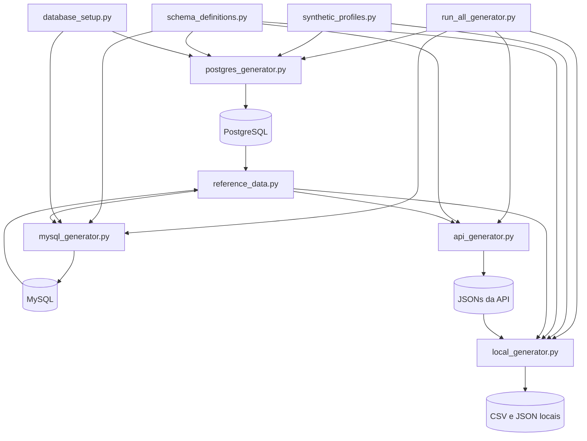

# Gerador de dados sintéticos

## 1. Objetivo

A pasta `data_generator` implementa a geração de dados sintéticos usados como fontes da plataforma. O processo simula um cenário de comércio eletrônico distribuído entre PostgreSQL, MySQL, uma API local e arquivos CSV/JSON.

Os geradores preservam relacionamentos entre clientes, produtos, pedidos, pagamentos, entregas, avaliações e eventos de navegação. Além de produzir dados válidos, o processo varia deliberadamente o volume de cada execução para permitir testes de ingestão, qualidade, transformação e observabilidade.

Os dados gerados são fictícios. Nomes, endereços, transações e demais atributos não representam pessoas ou operações reais.

## 2. Estrutura da pasta

```text
data_generator/
├── run_all_generator.py
├── postgres_generator.py
├── mysql_generator.py
├── api_generator.py
├── local_generator.py
├── database_setup.py
├── reference_data.py
├── schema_definitions.py
└── synthetic_profiles.py
```

| Arquivo | Responsabilidade |
| --- | --- |
| `run_all_generator.py` | Coordena a geração completa ou parcial, respeitando a ordem de dependências. |
| `postgres_generator.py` | Gera fornecedores, clientes e produtos no PostgreSQL. |
| `mysql_generator.py` | Gera pedidos, itens e estoque no MySQL e avança o ciclo de pedidos antigos. |
| `api_generator.py` | Gera avaliações, campanhas e cotações nos JSONs publicados pela API local. |
| `local_generator.py` | Gera cupons, pagamentos, rastreamento de entregas e eventos do site. |
| `database_setup.py` | Conecta aos bancos e cria o banco, tabelas e estruturas ausentes. |
| `reference_data.py` | Carrega referências entre fontes e valida a integridade dos registros gerados. |
| `schema_definitions.py` | Define DDLs, cabeçalhos CSV e JSON Schemas. |
| `synthetic_profiles.py` | Fornece nomes, endereços e perfis de dispositivos sintéticos. |

## 3. Fontes e destinos

| Fonte simulada | Dataset | Destino |
| --- | --- | --- |
| PostgreSQL | `suppliers` | `data_platform.public.suppliers` |
| PostgreSQL | `customers` | `data_platform.public.customers` |
| PostgreSQL | `products` | `data_platform.public.products` |
| MySQL | `orders` | `data_platform.orders` |
| MySQL | `order_items` | `data_platform.order_items` |
| MySQL | `inventory` | `data_platform.inventory` |
| API local | `marketing_campaigns` | `api_data_platform/dataset/api_marketing_campaigns.json` |
| API local | `exchange_rates` | `api_data_platform/dataset/api_exchange_rates.json` |
| API local | `customer_reviews` | `api_data_platform/dataset/api_customer_reviews.json` |
| Arquivo local | `coupons` | `local_data_source/coupons.csv` |
| Arquivo local | `payments` | `local_data_source/payments.csv` |
| Arquivo local | `delivery_tracking` | `local_data_source/delivery_tracking.csv` |
| Arquivo local | `website_events` | `local_data_source/website_events.json` |

Os datasets chamados de “API local” são gravados diretamente por `api_data_platform.data_store`. A API HTTP não precisa estar em execução durante a geração.

## 4. Arquitetura do processo



## 5. Ordem de dependências

O orquestrador define uma ordem topológica para garantir que uma entidade exista antes de ser referenciada:

```text
suppliers
customers
coupons
marketing_campaigns
exchange_rates
└── products
    └── orders
        └── order_items
            └── inventory
                └── payments
                    └── delivery_tracking
                        └── customer_reviews
                            └── website_events
```

As dependências efetivas são:

| Etapa | Dependências |
| --- | --- |
| `suppliers` | Nenhuma |
| `customers` | Nenhuma |
| `coupons` | Nenhuma |
| `marketing_campaigns` | Nenhuma |
| `exchange_rates` | Nenhuma |
| `products` | `suppliers` |
| `orders` | `customers`, `products`, `coupons` |
| `order_items` | `orders`, `products` |
| `inventory` | `products`, `order_items` |
| `payments` | `orders`, `order_items`, `inventory` |
| `delivery_tracking` | `orders`, `payments` |
| `customer_reviews` | `customers`, `products`, `order_items`, `delivery_tracking` |
| `website_events` | `customers`, `products`, `orders`, `marketing_campaigns`, `customer_reviews`, `payments`, `delivery_tracking` |

Ao usar `--steps`, o orquestrador ordena somente as etapas informadas; ele não inclui automaticamente dependências omitidas. Os dados necessários devem existir de uma execução anterior. Se qualquer etapa MySQL for selecionada, `orders`, `order_items` e `inventory` devem ser executadas juntas.

## 6. Funcionamento por gerador

### 6.1 PostgreSQL

O `postgres_generator.py` cria o catálogo principal:

- **suppliers:** fornecedores sintéticos, condições de pagamento e prazo de entrega;
- **customers:** pessoas e empresas, endereço, canal de aquisição e consentimento de marketing;
- **products:** catálogo, SKU, categoria, fornecedor, preço, custo, peso e dimensões.

No cenário normal, o volume total fica entre 90% e 110% da média solicitada. A distribuição aproximada é:

- 0,5% fornecedores;
- 9,5% produtos;
- o restante clientes.

O banco `data_platform`, o schema `public`, as tabelas, índices e triggers de auditoria são criados quando estão ausentes. Estruturas já existentes são verificadas antes da escrita. Cada execução usa identificadores naturais com `run_id` para evitar colisões de e-mail, SKU e código de fornecedor.

Na execução individual, o lote de fornecedores, clientes e produtos é gravado em uma transação PostgreSQL. No orquestrador completo, cada etapa é confirmada separadamente.

### 6.2 MySQL

O `mysql_generator.py` carrega clientes e produtos ativos do PostgreSQL e gera:

- pedidos com canal, status, endereço, valores e eventual cupom;
- um ou mais itens coerentes com o catálogo;
- reservas e movimentações de estoque no armazém `WH-SP-01`.

Antes de inserir novos pedidos, o processo pode avançar pedidos sintéticos existentes:

- pedidos `shipped` antigos tornam-se `delivered`;
- pedidos `paid` elegíveis tornam-se `shipped` quando há estoque reservado suficiente.

As operações MySQL usam:

- tabelas InnoDB;
- transação única para ciclo de vida, estoque, pedidos e itens;
- `rollback` em caso de falha;
- named lock com espera de até 30 segundos para impedir duas gerações simultâneas no mesmo banco.

O número médio informado representa pedidos. Cada pedido pode produzir de um a cinco itens.

### 6.3 Dados da API local

O `api_generator.py` gera:

- **customer_reviews:** notas de 1 a 5, comentários e vínculo opcional com uma compra entregue;
- **marketing_campaigns:** campanhas programadas, ativas, pausadas ou concluídas, com orçamento e UTMs;
- **exchange_rates:** uma cotação diária determinística de USD/BRL e EUR/BRL.

Avaliações verificadas são associadas a pares de pedido e produto ainda não avaliados. Quando não há compra elegível, o gerador cria uma avaliação não verificada usando cliente e produto válidos.

A cotação diária usa a data como seed própria. Assim, a mesma data produz o mesmo valor sintético. Na persistência, `data_store` evita duplicidade pela combinação `date`, `provider` e `rate_type`.

Os dados são validados e acrescentados aos arquivos de `api_data_platform/dataset`. Não existe chamada HTTP nesse fluxo.

### 6.4 Arquivos locais

O `local_generator.py` gera:

- **coupons:** código, desconto, limites de uso e período de validade;
- **payments:** pagamento compatível com o pedido, moeda, total e estado;
- **delivery_tracking:** rastreamento para pedidos enviados ou entregues;
- **website_events:** sessões com `page_view`, `add_to_cart` e `checkout_started`.

Cupons são armazenados em CSV e podem ser gerados sem conexão aos bancos. Pagamentos e rastreamento precisam de pedidos válidos. Eventos do site utilizam clientes, produtos e, quando aplicável, campanhas ativas para preencher origem de tráfego e parâmetros UTM.

Os CSVs preservam o cabeçalho definido em `schema_definitions.py`. O JSON de eventos é validado pelo JSON Schema antes da gravação. Os novos registros são acrescentados ao conteúdo existente, e o arquivo completo é reescrito em UTF-8.

## 7. Integridade referencial

O módulo `reference_data.py` lê uma visão consistente das fontes e elimina referências inválidas antes de disponibilizá-las aos geradores.

As principais verificações são:

- clientes e produtos devem existir no PostgreSQL;
- produtos usados pelo MySQL devem estar ativos, em BRL e possuir SKU válido;
- pedidos devem apontar para clientes existentes;
- itens devem apontar para produtos existentes e manter o SKU do catálogo;
- pedidos entregues devem possuir `delivered_at`;
- pagamentos devem possuir o mesmo valor total e moeda do pedido;
- relações entre `order_id`, `customer_id` e `product_id` devem ser compatíveis.

Um lote com referência inconsistente é rejeitado antes da gravação do arquivo correspondente.

## 8. Controle de volume e anomalias

Cada fonte possui 10% de probabilidade de simular uma anomalia de baixo volume:

| Cenário | Faixa em relação à média |
| --- | --- |
| Normal | 90% a 110% |
| Anômalo | 10% a 40% |

No `run_all_generator.py`, PostgreSQL, MySQL, API e arquivos locais recebem geradores pseudoaleatórios separados. Quando `--seed` é informado, uma seed derivada por fonte evita que alterações em um gerador desloquem toda a sequência aleatória dos demais.

O resumo enviado ao terminal informa se cada fonte foi considerada anômala e quantos registros foram processados.

## 9. Seeds e identificadores de execução

- Sem `--seed`, cada execução varia naturalmente.
- Com `--seed`, volumes e escolhas pseudoaleatórias podem ser reproduzidos, desde que as referências de entrada permaneçam iguais.
- O `run_id` diferencia entidades entre execuções.
- Na execução parcial, `--run-id` é transformado em um identificador estável de 32 caracteres.
- Se `--run-id` for informado sem `--seed`, o próprio identificador é usado para derivar uma seed estável.

Uma seed não torna toda a execução idempotente: os bancos e arquivos continuam recebendo novos registros, e IDs sequenciais dependem do estado já persistido.

## 10. Configuração

Crie ou atualize o arquivo `.env` na raiz do projeto com as conexões:

```dotenv
PG_HOST=localhost
PG_PORT=5432
PG_USER=seu_usuario
PG_PASSWORD=sua_senha

MYSQL_HOST=localhost
MYSQL_PORT=3306
MYSQL_USER=seu_usuario
MYSQL_PASSWORD=sua_senha
```

O nome de banco usado pelos geradores é fixado como `data_platform` em `schema_definitions.py`. As funções de setup criam esse banco quando ele não existe. O usuário configurado precisa ter permissões para criar o banco e suas tabelas na primeira execução.

As chaves efetivamente obrigatórias são:

- `PG_HOST`, `PG_PORT`, `PG_USER`, `PG_PASSWORD`;
- `MYSQL_HOST`, `MYSQL_PORT`, `MYSQL_USER`, `MYSQL_PASSWORD`.

## 11. Pré-requisitos

- Python e o ambiente virtual `.venv` do projeto;
- dependências de `requirements.txt` instaladas;
- PostgreSQL acessível;
- MySQL acessível;
- credenciais configuradas no `.env`;
- permissão de escrita em `api_data_platform/dataset` e `local_data_source`.

Instalação das dependências no Windows PowerShell:

```powershell
.\.venv\Scripts\python.exe -m pip install -r requirements.txt
```

Execute os comandos a partir da raiz do repositório.

## 12. Executar o processo completo

O comando recomendado para uma execução local completa é:

```powershell
.\.venv\Scripts\python.exe data_generator\run_all_generator.py
```

O volume médio padrão é de 2.000 registros por fonte. Para escolher outra média:

```powershell
.\.venv\Scripts\python.exe data_generator\run_all_generator.py --average-records 5000
```

O valor deve estar entre 100 e 100.000.

### Execução reproduzível

```powershell
.\.venv\Scripts\python.exe data_generator\run_all_generator.py --average-records 2000 --seed 20260920
```

### Simulação sem conexões ou escrita

```powershell
.\.venv\Scripts\python.exe data_generator\run_all_generator.py --average-records 2000 --seed 20260920 --dry-run
```

No orquestrador completo, `--dry-run` somente calcula e exibe a ordem, os volumes e as anomalias. Ele não abre conexões e não grava dados.

## 13. Executar etapas específicas

Use `--steps` para selecionar etapas já suportadas por referências existentes:

```powershell
.\.venv\Scripts\python.exe data_generator\run_all_generator.py `
  --steps marketing_campaigns exchange_rates `
  --average-records 2000 `
  --run-id execucao-2026-09-20
```

Outro exemplo, executando o grupo MySQL obrigatório:

```powershell
.\.venv\Scripts\python.exe data_generator\run_all_generator.py `
  --steps orders order_items inventory `
  --average-records 1000 `
  --seed 42
```

Selecionar apenas `orders` ou apenas `order_items` é rejeitado, pois as três etapas MySQL precisam compartilhar a mesma transação e o mesmo estado em memória.

## 14. Executar geradores individuais

### PostgreSQL

```powershell
.\.venv\Scripts\python.exe data_generator\postgres_generator.py --average-records 2000
```

Faixa aceita: 30 a 100.000 registros.

### MySQL

```powershell
.\.venv\Scripts\python.exe data_generator\mysql_generator.py --average-orders 2000
```

Faixa aceita: 1 a 100.000 pedidos. O catálogo PostgreSQL precisa existir antes dessa execução.

### Datasets da API

Todos os datasets:

```powershell
.\.venv\Scripts\python.exe data_generator\api_generator.py --average-records 2000
```

Somente campanhas e câmbio:

```powershell
.\.venv\Scripts\python.exe data_generator\api_generator.py `
  --datasets marketing_campaigns exchange_rates `
  --average-records 2000
```

Faixa aceita: 30 a 100.000 registros. `customer_reviews` exige referências válidas no PostgreSQL e MySQL; campanhas e câmbio podem ser gerados sem essas referências.

### Arquivos locais

Todos os datasets:

```powershell
.\.venv\Scripts\python.exe data_generator\local_generator.py --average-records 2000
```

Somente cupons:

```powershell
.\.venv\Scripts\python.exe data_generator\local_generator.py `
  --datasets coupons `
  --average-records 2000
```

Faixa aceita: 100 a 100.000 registros. Cupons não dependem dos bancos; os demais datasets dependem das referências correspondentes.

Todos os scripts individuais aceitam `--seed` e `--dry-run`. Entretanto, o significado de `--dry-run` não é idêntico em todos eles:

- PostgreSQL gera somente em memória e não conecta ao banco;
- MySQL consulta o catálogo PostgreSQL, mas não grava no MySQL;
- API pode consultar referências e arquivos existentes, mas não persiste;
- local lê arquivos e pode consultar referências, mas não persiste.

## 15. Inicialização automática dos bancos

`database_setup.py` tenta preparar a estrutura necessária:

1. conecta ao banco `data_platform`;
2. se o banco não existir, conecta ao banco administrativo e o cria;
3. cria tabelas ausentes usando os DDLs de `schema_definitions.py`;
4. cria triggers de atualização no PostgreSQL;
5. confirma a estrutura antes de devolver a conexão.

Tabelas existentes não são migradas automaticamente. Se uma tabela estiver incompatível, os geradores interrompem a execução e solicitam a aplicação do novo DDL.

## 16. Transações e comportamento em falhas

Não existe uma transação distribuída entre PostgreSQL, MySQL e arquivos.

- No MySQL, pedidos, itens e estoque são confirmados juntos ou sofrem rollback juntos.
- No PostgreSQL, a execução individual agrupa o lote; no orquestrador, as etapas podem ser confirmadas separadamente.
- JSONs e CSVs são reescritos por arquivo e não participam das transações dos bancos.
- Se uma etapa tardia falhar, etapas anteriores já confirmadas permanecem persistidas.

O `run_all_generator.py` imprime as etapas confirmadas ao relatar uma falha. Seus códigos de saída são:

- `0`: sucesso;
- `1`: falha de execução;
- `130`: interrupção pelo usuário.

## 17. Orquestração pelo Airflow

O DAG `synthetic_data_daily_generation`, em `airflow/dags/synthetic_data_daily.py`, executa os geradores individuais diariamente às 01:00 no fuso `America/Sao_Paulo`.

A sequência configurada é:

```text
PostgreSQL
→ cupons
→ campanhas e câmbio
→ pedidos, itens e estoque
→ pagamentos e entregas
→ avaliações
→ eventos do site
```

O DAG usa:

- `GENERATOR_AVERAGE_RECORDS` para o volume médio;
- a data final do intervalo como seed diária;
- `max_active_runs=1` para impedir duas execuções simultâneas do DAG.

O Airflow é apenas uma forma de orquestração. Os comandos locais não dependem dele.

## 18. Saída e acompanhamento

Os scripts escrevem resumos JSON no terminal com informações como:

- `run_id`;
- horário da execução;
- cenário anômalo ou normal;
- quantidade gerada por tabela ou dataset;
- modo `dry_run`;
- movimentações de estoque e ciclo de pedidos, quando aplicável.

O gerador não envia métricas diretamente ao Pushgateway. A integração com Prometheus ocorre no pipeline principal e na instrumentação HTTP da API.

## 19. Cuidados operacionais

- Não execute mais de um gerador de arquivos ao mesmo tempo; os locks de JSON e CSV não coordenam processos diferentes.
- O MySQL possui named lock, mas esse lock não protege PostgreSQL nem arquivos.
- Faça backup dos arquivos locais antes de testes destrutivos ou grandes volumes.
- Use `--dry-run` antes de aumentar significativamente a média.
- Seeds repetidas não impedem duplicação nem substituem uma estratégia de idempotência.
- Confirme o espaço em disco: os arquivos são carregados e regravados integralmente.
- Não edite manualmente CSVs ou JSONs durante uma geração.

## 20. Solução de problemas

### Configurações ausentes

Erros indicando `PG_*` ou `MYSQL_*` ausentes significam que o `.env` não possui todas as chaves obrigatórias ou que seus valores estão vazios.

### Banco inacessível

Verifique host, porta, credenciais, firewall e se o serviço do banco está ativo. A conexão usa timeout de 10 segundos.

### Schema incompatível

O gerador não altera tabelas existentes. Compare a tabela com os DDLs em `schema_definitions.py` e aplique a migração necessária antes de tentar novamente.

### Referências inválidas ou vazias

Execute primeiro o gerador PostgreSQL e depois o MySQL. Pagamentos, entregas, avaliações e eventos dependem dessas referências.

### Outra geração MySQL está ativa

O named lock não foi adquirido em 30 segundos. Aguarde a execução atual terminar antes de iniciar outra.

### Volume menor que o solicitado

Isso pode ser uma anomalia intencional de volume ou uma limitação de candidatos elegíveis, como pedidos ainda sem pagamento, entrega ou avaliação.

### Arquivo CSV rejeitado

Confirme que o cabeçalho corresponde a `CSV_HEADERS` e que todas as linhas possuem a quantidade correta de campos. O arquivo é preservado quando uma estrutura desconhecida é detectada.
