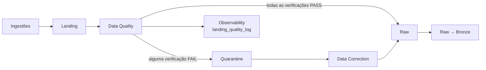
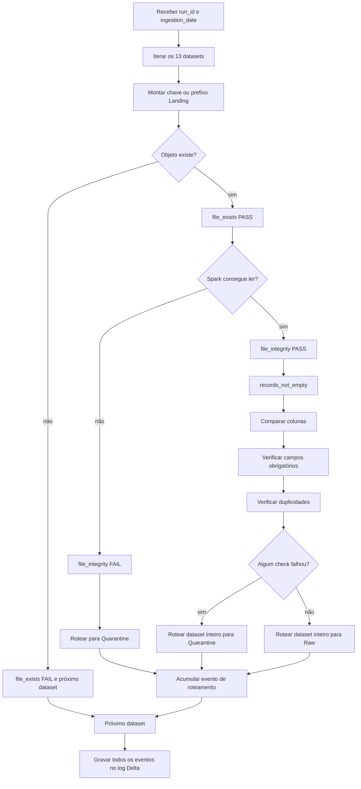

# Processo de qualidade de dados

## 1. Objetivo

A pasta `src/data_quality` implementa a validação da camada Landing e o roteamento dos datasets para Raw ou Quarantine.

O processo verifica se cada entrega esperada existe, pode ser lida, possui as colunas previstas, não contém valores ausentes em campos obrigatórios e não apresenta chaves primárias duplicadas. Com base no resultado agregado, o dataset inteiro é movido para:

- `raw`, quando todas as verificações passam;
- `quarantine`, quando pelo menos uma verificação falha.

Além do roteamento, cada verificação produz um evento persistido na camada de observabilidade.

## 2. Estrutura e arquivos relacionados

```text
src/
├── data_quality/
│   └── dq_landing_raw.py
├── observability/
│   └── obs_landing_quality_log.py
├── schemas/
│   └── schemas.py
├── path_constants/
│   └── path_constants.py
└── utils/
    ├── job.py
    ├── s3_client.py
    ├── s3_transfer.py
    └── spark_session.py
```

| Arquivo | Responsabilidade |
| --- | --- |
| `dq_landing_raw.py` | Define contratos, executa verificações e roteia objetos. |
| `obs_landing_quality_log.py` | Persiste os eventos de qualidade em Delta. |
| `schemas.py` | Centraliza schemas Bronze, campos obrigatórios, chaves e schema do log. |
| `path_constants.py` | Define os buckets `landing`, `raw`, `quarantine` e `observability`. |
| `job.py` | Fornece argumentos CLI, sessão Spark e cliente S3 obrigatório. |
| `s3_client.py` | Cria o cliente boto3 para S3/MinIO. |
| `s3_transfer.py` | Configura cópias multipart entre buckets. |
| `spark_session.py` | Configura Spark, Delta Lake e S3A. |

## 3. Posição no pipeline



Na DAG `data_platform_monthly_pipeline`, a tarefa é:

```text
validate_landing_and_route_raw
```

Ela executa depois das quatro ingestões e antes da correção de quarentena.

## 4. Função pública

A entrada principal é:

```python
dq_landing_raw(spark, run_id, ingestion_date, s3_client)
```

Parâmetros:

| Parâmetro | Uso |
| --- | --- |
| `spark` | Leitura dos datasets e cálculos de qualidade. |
| `run_id` | Correlação dos eventos com a execução do pipeline. |
| `ingestion_date` | Seleciona a partição Landing `YYYYMMDD`. |
| `s3_client` | Descoberta, cópia e exclusão dos objetos. |

Validações imediatas:

- `spark` não pode ser `None`;
- `s3_client` não pode ser `None`.

O tipo de `ingestion_date` não é validado explicitamente; o objeto precisa suportar `strftime`.

## 5. Buckets

| Bucket | Papel |
| --- | --- |
| `landing` | Origem dos arquivos recém-ingeridos. |
| `raw` | Destino de datasets aprovados. |
| `quarantine` | Destino de datasets com alguma reprovação. |
| `observability` | Armazena o log Delta de qualidade. |

Os nomes estão definidos em `src/path_constants/path_constants.py`.

O Spark usa caminhos `s3a://`; operações de descoberta e movimentação usam o cliente boto3 com bucket e chave, e os eventos registram caminhos `s3://`.

## 6. Datasets validados

O processo avalia 13 datasets em ordem fixa:

| Ordem | Dataset | Fonte | Formato | Chave primária |
| --- | --- | --- | --- | --- |
| 1 | `coupons` | local | CSV | `coupon` |
| 2 | `delivery_tracking` | local | CSV | `tracking_id` |
| 3 | `payments` | local | CSV | `payment_id` |
| 4 | `website_events` | local | JSON | `event_id` |
| 5 | `customer_review` | API | JSON | `review_id` |
| 6 | `exchange_rates` | API | JSON | `exchange_rate_id` |
| 7 | `marketing_campaigns` | API | JSON | `campaign_id` |
| 8 | `customers` | PostgreSQL | Parquet | `customer_id` |
| 9 | `products` | PostgreSQL | Parquet | `product_id` |
| 10 | `suppliers` | PostgreSQL | Parquet | `supplier_id` |
| 11 | `inventory` | MySQL | Parquet | `inventory_id` |
| 12 | `order_items` | MySQL | Parquet | `order_item_id` |
| 13 | `orders` | MySQL | Parquet | `order_id` |

O dicionário `LANDING_DATASETS` também informa nome físico, fonte e formato de cada item.

## 7. Fonte dos contratos

Embora `LANDING_DATASETS` declare listas iniciais, o módulo as substitui durante a importação:

```python
config["required_columns"] = [
    field.name for field in BRONZE_DATASET_SCHEMAS[dataset].fields
]
config["required_fields"] = DATASET_REQUIRED_FIELDS[dataset]
```

Consequências:

- a lista efetiva de colunas esperadas é o schema completo da camada Bronze;
- campos opcionais também precisam existir como colunas, mesmo que possam conter `null`;
- a nulabilidade é controlada separadamente por `DATASET_REQUIRED_FIELDS`;
- qualidade Landing e transformação Bronze compartilham a mesma fonte estrutural.

Essa centralização reduz divergência entre validação e transformação.

## 8. Campos obrigatórios

Os campos abaixo não podem ser nulos nem strings vazias:

| Dataset | Campos obrigatórios |
| --- | --- |
| `coupons` | `coupon`, `discount`, `discount_type`, `currency`, `minimum_order_amount`, `is_active`, `start_date`, `end_date`, `created_at`, `updated_at` |
| `delivery_tracking` | `tracking_id`, `order_id`, `shipment_id`, `tracking_code`, `carrier`, `service_level`, `status`, `country_code`, `occurred_at`, `created_at`, `updated_at` |
| `payments` | `payment_id`, `order_id`, `transaction_reference`, `payment_method`, `payment_status`, `amount`, `currency`, `installments`, `provider`, `refunded_amount`, `created_at`, `updated_at` |
| `website_events` | `event_id`, `session_id`, `event`, `page`, `timestamp`, `created_at`, `updated_at` |
| `customer_review` | `review_id`, `customer_id`, `product_id`, `rating`, `verified_purchase`, `moderation_status`, `created_at`, `updated_at` |
| `exchange_rates` | `exchange_rate_id`, `date`, `base_currency`, `usd_brl`, `eur_brl`, `provider`, `published_at`, `created_at`, `updated_at` |
| `marketing_campaigns` | `campaign_id`, `campaign`, `channel`, `status`, `budget`, `currency`, `start_date`, `end_date`, `created_at`, `updated_at` |
| `customers` | `customer_id`, `name`, `email`, `customer_type`, `country_code`, `marketing_opt_in`, `status`, `created_at`, `updated_at` |
| `products` | `product_id`, `sku`, `name`, `category`, `supplier_id`, `price`, `currency`, `is_active`, `created_at`, `updated_at` |
| `suppliers` | `supplier_id`, `supplier_code`, `supplier_name`, `country_code`, `payment_terms_days`, `is_active`, `created_at`, `updated_at` |
| `inventory` | `inventory_id`, `product_id`, `warehouse_code`, `quantity_available`, `quantity_reserved`, `quantity_damaged`, `reorder_point`, `safety_stock`, `created_at`, `updated_at` |
| `order_items` | `order_item_id`, `order_id`, `line_number`, `product_id`, `sku`, `product_name`, `quantity`, `unit_price`, `discount_amount`, `tax_amount`, `line_total`, `currency`, `created_at`, `updated_at` |
| `orders` | `order_id`, `order_number`, `customer_id`, `order_date`, `status`, `sales_channel`, `currency`, `subtotal_amount`, `discount_amount`, `shipping_amount`, `tax_amount`, `total_amount`, `shipping_recipient`, `shipping_address_line`, `shipping_postal_code`, `shipping_city`, `shipping_state`, `shipping_country_code`, `created_at`, `updated_at` |

## 9. Organização dos objetos Landing

A partição é construída com:

```text
ingestion_date_YYYYMMDD
```

### Datasets de arquivo único

CSV e JSON possuem uma chave exata:

```text
<dataset>/ingestion_date_YYYYMMDD/<file_name>
```

Exemplos:

```text
coupons/ingestion_date_20260920/coupons.csv
customer_review/ingestion_date_20260920/customer_review.json
```

Existência é verificada com `head_object`.

### Datasets particionados

Os datasets vindos dos bancos usam um prefixo:

```text
<dataset>/ingestion_date_YYYYMMDD/
```

Datasets particionados:

- `customers`;
- `products`;
- `suppliers`;
- `inventory`;
- `order_items`;
- `orders`.

A listagem percorre todas as páginas de `list_objects_v2`. O prefixo é considerado existente quando pelo menos uma chave termina com `.parquet`.

Todos os objetos encontrados no prefixo são preservados para o roteamento, inclusive arquivos auxiliares que não terminem em `.parquet`.

## 10. Leitura por formato

| Formato | Leitor Spark |
| --- | --- |
| CSV | `header=true`, `inferSchema=true` |
| JSON | `multiLine=true` |
| Parquet | `spark.read.parquet` |

Um formato não reconhecido gera `ValueError`.

Para um dataset vazio e sem colunas detectáveis, o código cria um dataframe vazio usando o schema Bronze. Isso permite que as verificações estruturais seguintes sejam executadas.

## 11. Fluxo completo



## 12. Verificações de qualidade

### 12.1 `file_exists`

- `check_type`: `existence`;
- objetivo: confirmar a entrega esperada na partição;
- arquivo único: usa `head_object`;
- Parquet: exige ao menos uma parte `.parquet` sob o prefixo.

Se falhar:

- é criado somente o evento de existência para esse dataset;
- nenhuma leitura ou tentativa de roteamento ocorre;
- o loop continua no dataset seguinte.

### 12.2 `file_integrity`

- `check_type`: `format`;
- objetivo: verificar se o Spark consegue ler o formato configurado;
- sucesso: registra o total de linhas como válidas;
- falha: registra a exceção e tenta mover os objetos para Quarantine.

Essa verificação não comprova todos os tipos e regras do schema; ela confirma principalmente a capacidade de leitura.

### 12.3 `records_not_empty`

- `check_type`: `volume`;
- objetivo nominal: verificar se existem registros.

No código atual, esse evento é sempre criado com `PASS`, mesmo quando `total == 0`. A variável `is_empty` é calculada, mas não influencia o status.

Consequência: um dataset vazio não é reprovado por volume. Ele só irá para Quarantine se outra verificação falhar.

### 12.4 `required_columns`

- `check_type`: `schema`;
- compara conjuntos de nomes de colunas;
- detecta colunas ausentes;
- detecta colunas inesperadas.

Qualquer diferença reprova o dataset inteiro:

- `records_valid = 0`;
- `records_invalid = total`;
- `invalid_percentage = 100%` quando há linhas.

A ordem das colunas não é verificada. Os tipos também não são comparados nessa etapa.

### 12.5 `required_fields_not_null`

- `check_type`: `null`;
- considera inválida uma linha com `null` ou string vazia em qualquer campo obrigatório;
- strings são avaliadas depois de `trim`.

O check só é executado quando todos os campos obrigatórios existem no dataframe. Se algum estiver ausente, a falha já aparece em `required_columns` e o evento de nulos não é criado.

### 12.6 `duplicate_records`

- `check_type`: `duplicate`;
- usa a chave definida em `DATASET_PRIMARY_KEYS`;
- calcula `total - dropDuplicates(primary_keys).count()`.

Todas as linhas excedentes de cada chave são contabilizadas como duplicadas. O processo não remove duplicatas; ele apenas reprova e roteia o conjunto.

## 13. Quantidade de eventos por dataset

O número de eventos varia conforme o ponto da falha:

| Situação | Eventos esperados |
| --- | --- |
| Objeto ausente | `file_exists` |
| Objeto presente, mas ilegível | `file_exists`, `file_integrity`, roteamento |
| Objeto legível com todos os campos obrigatórios presentes | Até sete eventos, incluindo roteamento |
| Coluna obrigatória ausente | O check de nulos é omitido; os demais continuam, se possível |

Em um fluxo completo e legível, os eventos são:

1. `file_exists`;
2. `file_integrity`;
3. `records_not_empty`;
4. `required_columns`;
5. `required_fields_not_null`;
6. `duplicate_records`;
7. `route_to_raw` ou `route_to_quarantine`.

## 14. Decisão de roteamento

O método `_route_validated_object` recebe todos os eventos já produzidos para o dataset e avalia:

```python
has_quality_failure = any(
    validation["check_status"] == "FAIL"
    for validation in dataset_validations
)
```

Não existe tolerância percentual. Uma única linha nula, uma única duplicidade ou uma única coluna extra envia o dataset inteiro para Quarantine.

| Resultado agregado | Destino | Evento |
| --- | --- | --- |
| Nenhum `FAIL` | `raw` | `route_to_raw` |
| Pelo menos um `FAIL` | `quarantine` | `route_to_quarantine` |

O evento de roteamento tem `check_type="routing"`.

## 15. Movimentação dos objetos

S3 não possui uma operação nativa de move. `_move_landing_objects` implementa:

1. calcula o prefixo de destino;
2. confirma que todas as chaves compartilham o mesmo prefixo de dataset/data;
3. remove objetos que já existam nesse prefixo do bucket de destino;
4. copia cada objeto de Landing para Raw ou Quarantine;
5. exclui os objetos originais de Landing.

### Configuração da cópia

`S3_TRANSFER_CONFIG` usa:

- threshold multipart de 16 MiB;
- chunks de 16 MiB;
- quatro transferências concorrentes;
- threads habilitadas.

### Substituição da partição de destino

Antes da cópia, todos os objetos existentes no mesmo prefixo de destino são apagados. Isso evita partes antigas misturadas com a entrega atual, mas torna o roteamento uma substituição destrutiva da partição.

Não há transação entre exclusão, cópia e remoção da origem. Uma falha intermediária pode deixar objetos parciais no destino ou parte da origem já removida.

## 16. Eventos de roteamento

Quando a movimentação funciona:

- `check_status = PASS`;
- `records_valid = records_total`;
- `records_invalid = 0`.

Quando falha:

- `check_status = FAIL`;
- `records_valid = 0`;
- `records_invalid = records_total`;
- `invalid_percentage = 100%` quando o dataset possui registros;
- `error_message` recebe classe e mensagem da exceção.

O caminho registrado é o destino pretendido, mesmo quando a movimentação falha.

## 17. Evento de qualidade

Cada verificação gera um dicionário com o schema `landing_quality_log_schema`:

| Campo | Descrição |
| --- | --- |
| `run_id` | Identificador da execução. |
| `file_name` | Nome físico ou lógico do arquivo. |
| `source_name` | `local`, `api`, `postgres` ou `mysql`. |
| `file_path` | Caminho avaliado ou destino do roteamento. |
| `check_name` | Nome da verificação. |
| `check_type` | Categoria da verificação. |
| `records_total` | Quantidade total considerada. |
| `records_valid` | Quantidade considerada válida pelo check. |
| `records_invalid` | Quantidade considerada inválida. |
| `invalid_percentage` | Percentual inválido. |
| `check_status` | `PASS` ou `FAIL`. |
| `error_message` | Explicação da falha, quando houver. |
| `execution_ts` | Timestamp UTC da criação do evento. |

Os timestamps são criados em UTC e armazenados sem timezone explícito para compatibilidade com `TimestampType` do Spark.

## 18. Persistência da observabilidade

Depois de processar os datasets, os eventos são gravados em modo append:

```text
s3a://observability/landing_quality_log
```

Formato: Delta Lake.

O método `write_landing_quality_log`:

1. cria um dataframe com schema explícito;
2. grava com `format("delta")`;
3. usa `mode("append")`;
4. devolve o dataframe criado.

Se a escrita do log falhar, a exceção propaga depois que os roteamentos já podem ter ocorrido.

## 19. Logs da aplicação

Além da tabela Delta, o job escreve no logger:

- início e fim do processo;
- dataset e fonte em processamento;
- exceções de roteamento;
- resumo de todos os checks por arquivo;
- quantidade total de checks e falhas.

Exemplo conceitual do resumo:

```text
source=api file=customer_review.json
checks=[file_exists=PASS, file_integrity=PASS,
required_columns=PASS, duplicate_records=FAIL,
route_to_quarantine=PASS]
```

## 20. Retorno da função

`dq_landing_raw` devolve a lista completa de eventos. O retorno pode ser usado por:

- CLI para decidir se a tarefa deve falhar;
- pipeline monolítico para métricas e decisão de sucesso;
- testes e validações programáticas.

O próprio método não lança erro apenas porque um check resultou em `FAIL`; a decisão de falhar o job é feita pelo chamador.

## 21. Execução pela linha de comando

Execute a partir da raiz do projeto. No Windows PowerShell:

```powershell
$env:PYTHONPATH = "$(Get-Location)\src;$(Get-Location)"
.\.venv\Scripts\python.exe src\data_quality\dq_landing_raw.py `
  --run-id manual_20260920 `
  --date 2026-09-20
```

Argumentos:

| Argumento | Obrigatório | Formato |
| --- | --- | --- |
| `--run-id` | Sim | Identificador textual da execução. |
| `--date` | Sim | Data ISO `YYYY-MM-DD`. |

Não existe opção `--dry-run`. O job move e exclui objetos durante o roteamento.

## 22. Critério de falha da CLI e do Airflow

Depois que a função retorna, o bloco CLI considera técnicas as falhas dos tipos:

- `existence`;
- `format`;
- `routing`.

Se ao menos uma delas existir, o script lança `RuntimeError` e termina com erro.

Falhas dos tipos abaixo não fazem o processo CLI falhar quando o roteamento para Quarantine foi concluído:

- `volume`;
- `schema`;
- `null`;
- `duplicate`.

Esse comportamento permite que a DAG prossiga para `correct_quarantined_data` quando o problema é considerado corrigível.

No Airflow, a tarefa recebe:

```text
python src/data_quality/dq_landing_raw.py \
  --run-id "$PIPELINE_RUN_ID" \
  --date "$PIPELINE_EXECUTION_DATE"
```

Com a trigger rule padrão, uma falha técnica bloqueia a correção e todas as tarefas downstream.

## 23. Diferença no pipeline monolítico

`src/run_all_pipeline.py` chama `dq_landing_raw` diretamente e depois verifica apenas falhas de roteamento:

```python
routing_failed = any(
    event.get("check_type") == "routing"
    and event.get("check_status") == "FAIL"
    for event in quality_events
)
```

Portanto, o comportamento não é idêntico ao CLI:

- CLI/Airflow falham com `existence`, `format` ou `routing`;
- executor monolítico marca falha global somente por `routing` nesse conjunto de eventos.

Uma ausência de arquivo, por exemplo, não gera evento de roteamento e pode não bloquear o executor monolítico atual.

## 24. Integração com Data Correction

Datasets enviados para Quarantine tornam-se entrada de `src/data_correction/data_correction.py`.

O processo de correção reutiliza:

- `LANDING_DATASETS`;
- schemas Bronze;
- campos obrigatórios;
- chaves primárias;
- `landing_quality_log` para localizar o `original_run_id`.

Somente falhas de schema, nulos e duplicidades roteadas com sucesso permitem que a tarefa Airflow de correção seja alcançada na mesma DAG. Falha de formato também envia o objeto à quarentena, mas o CLI encerra a tarefa de qualidade com erro e bloqueia a downstream até uma reexecução ou intervenção.

## 25. Integração com Raw → Bronze

`transformation_raw_bronze.py` reutiliza `LANDING_DATASETS` para descobrir o formato de cada dataset em Raw. Ele procura:

```text
raw/<dataset>/ingestion_date_YYYYMMDD/
```

Somente datasets presentes nessa partição são transformados. O schema Bronze é aplicado posteriormente; a validação Landing não faz cast completo dos tipos.

## 26. Pré-requisitos

- Python e dependências do projeto;
- Java para o Spark;
- MinIO ou S3 acessível;
- buckets `landing`, `raw`, `quarantine` e `observability`;
- credenciais com permissão de listar, consultar, copiar, gravar e excluir objetos;
- resolução dos pacotes Spark/Delta na primeira inicialização.

Variáveis principais:

```dotenv
AWS_ACCESS_KEY_ID=...
AWS_SECRET_ACCESS_KEY=...
AWS_ENDPOINT_URL=http://localhost:9000
SPARK_MASTER=local[*]
```

Configurações opcionais:

- `SPARK_WAREHOUSE_DIR`;
- `SPARK_SHUFFLE_PARTITIONS`;
- `SPARK_DEFAULT_PARALLELISM`;
- `SPARK_DELTA_OPTIMIZE_WRITE`;
- `SPARK_DELTA_AUTO_COMPACT`.

## 27. Consultar os resultados

Exemplo com PySpark:

```python
quality = spark.read.format("delta").load(
    "s3a://observability/landing_quality_log"
)

quality.filter("run_id = 'manual_20260920'").orderBy(
    "source_name",
    "file_name",
    "execution_ts",
).show(truncate=False)
```

Consultas úteis:

- falhas por `check_type`;
- datasets roteados para Quarantine;
- percentual inválido por dataset;
- falhas técnicas de existência ou formato;
- falhas de movimentação;
- evolução histórica por fonte.

## 28. Relação com métricas Prometheus

Quando o executor monolítico publica métricas, os eventos de qualidade alimentam:

```text
data_pipeline_quality_checks_failed{check_type="..."}
```

O dashboard do Grafana exibe essas contagens em “Failed Data Quality Checks”. A taxa `data_pipeline_quality_ratio`, por outro lado, é calculada a partir das rejeições da transformação Silver, não diretamente dos checks Landing.

A DAG mensal em tarefas separadas não publica automaticamente o conjunto agregado de métricas do executor monolítico.

## 29. Comportamento com dataset vazio

O código calcula:

```python
is_empty = total == 0
```

mas não usa esse valor na criação do evento. `records_not_empty` permanece `PASS`.

Se o Spark não detectar colunas em um dataframe vazio, o código injeta o schema Bronze vazio. Assim:

- o check de integridade passa;
- o check de volume passa;
- a estrutura tende a passar;
- nulos e duplicidades resultam em zero;
- o dataset vazio pode ser roteado para Raw.

Se volume zero precisar ser uma falha, o status deve usar `is_empty` explicitamente.

## 30. Comportamento com coluna primária ausente

`required_columns` registra a ausência e deveria enviar o dataset para Quarantine. Entretanto, o código ainda executa:

```python
dataframe.dropDuplicates(primary_keys)
```

Se uma coluna da chave não existir, o Spark pode lançar uma exceção de análise. Essa operação não possui tratamento isolado no loop do dataset; a exceção pode interromper o job antes do roteamento e da gravação dos eventos acumulados.

Esse cenário merece tratamento defensivo antes da verificação de duplicidade.

## 31. Atomicidade e recuperação

O processo não é transacional entre buckets e log:

```text
apagar destino anterior
→ copiar objetos
→ apagar origem Landing
→ continuar outros datasets
→ gravar log Delta no final
```

Falhas possíveis:

- destino anterior removido, mas cópia incompleta;
- cópia concluída, mas origem apenas parcialmente removida;
- roteamento concluído, mas log Delta não gravado;
- datasets iniciais movidos, seguido de exceção em um dataset posterior.

Não existe rollback automático. A recuperação deve usar inventário dos buckets, logs de aplicação e, quando disponível, o log Delta da execução.

## 32. Performance

Para cada dataset legível, existem múltiplas ações Spark:

- `dataframe.count()`;
- contagem dos registros com campos obrigatórios inválidos;
- `dropDuplicates(...).count()`.

O dataframe não é persistido em cache. Dependendo do plano do Spark e do tamanho da fonte, essas ações podem reler os dados mais de uma vez.

Possíveis otimizações:

- persistir o dataframe durante os checks;
- consolidar agregações em menos ações;
- liberar o cache após o roteamento;
- paralelizar datasets independentes com controle de recursos;
- coletar estatísticas sem repetir scans completos.

## 33. Limitações atuais

- o check de volume não reprova datasets vazios;
- não há validação de tipos contra o schema Bronze;
- não há validação de domínio, faixa ou relação entre datasets;
- qualquer falha reprova e move o dataset inteiro;
- não há tolerância percentual configurável;
- o roteamento apaga previamente a partição do destino;
- cópia, exclusão e log não são atômicos;
- uma chave primária ausente pode interromper o job;
- os datasets são processados sequencialmente;
- o dataframe não é cacheado entre checks;
- não existe `dry-run`;
- não há política automática de retenção para Quarantine.

## 34. Verificação operacional

Antes da execução:

1. confirme que as quatro ingestões terminaram;
2. confira a partição `ingestion_date_YYYYMMDD` em Landing;
3. valide a existência dos 13 datasets esperados;
4. confirme buckets e permissões;
5. verifique se Raw ou Quarantine já contêm uma partição que será substituída;
6. confirme o `run_id` e a data lógica.

Depois da execução:

1. consulte `landing_quality_log` pelo `run_id`;
2. revise todos os eventos `FAIL`;
3. confirme o destino de cada dataset;
4. verifique se Landing não manteve objetos já roteados;
5. confira se a tarefa de correção deve atuar sobre Quarantine;
6. investigue falhas técnicas antes de reexecutar downstreams.

## 35. Solução de problemas

### `file_exists` falhou

Confira a data informada, o nome do dataset e o caminho produzido pela ingestão. Para bancos, confirme que existe pelo menos uma parte `.parquet`.

### `file_integrity` falhou

O Spark não conseguiu ler o formato configurado. Inspecione corrupção, encoding, estrutura JSON, cabeçalho CSV ou arquivos Parquet incompletos.

### `required_columns` falhou por coluna opcional

Todas as colunas do schema Bronze são esperadas, inclusive as anuláveis. A origem precisa publicar a coluna, mesmo que seu valor seja `null`.

### `required_fields_not_null` falhou

Localize os campos obrigatórios nulos ou vazios. O job não remove essas linhas; o dataset completo é enviado à quarentena.

### `duplicate_records` falhou

Revise a chave primária definida em `DATASET_PRIMARY_KEYS`. O job não escolhe automaticamente qual duplicata preservar.

### Roteamento falhou

Confira permissões de listar, excluir e copiar nos três buckets, conectividade, espaço e possíveis objetos parcialmente movimentados.

### Dataset vazio foi aprovado

Esse é o comportamento atual: `records_not_empty` sempre recebe `PASS`.

### A tarefa falhou antes de gravar o log

Uma exceção fora dos blocos tratados, como chave primária ausente durante `dropDuplicates`, pode interromper o loop. Inspecione os buckets e o log textual do job.

### A tarefa passou com dados em Quarantine

Falhas de schema, nulos e duplicidades não tornam o CLI failed quando o roteamento funciona. A etapa seguinte deve processar a quarentena.

## 36. Evoluções recomendadas

1. corrigir `records_not_empty` para usar `is_empty`;
2. verificar a existência da chave antes de `dropDuplicates`;
3. validar tipos em relação ao schema Bronze;
4. permitir thresholds de qualidade por dataset;
5. separar registros válidos e inválidos em vez de mover o lote inteiro;
6. escrever um manifesto de roteamento para recuperação;
7. evitar apagar o destino antes de uma cópia confirmada;
8. gravar eventos incrementalmente ou com checkpoint;
9. adicionar modo `dry-run`;
10. persistir dataframes durante múltiplos checks;
11. padronizar o critério de falha entre CLI e executor monolítico;
12. adicionar testes de integração com MinIO para falhas parciais de cópia.
